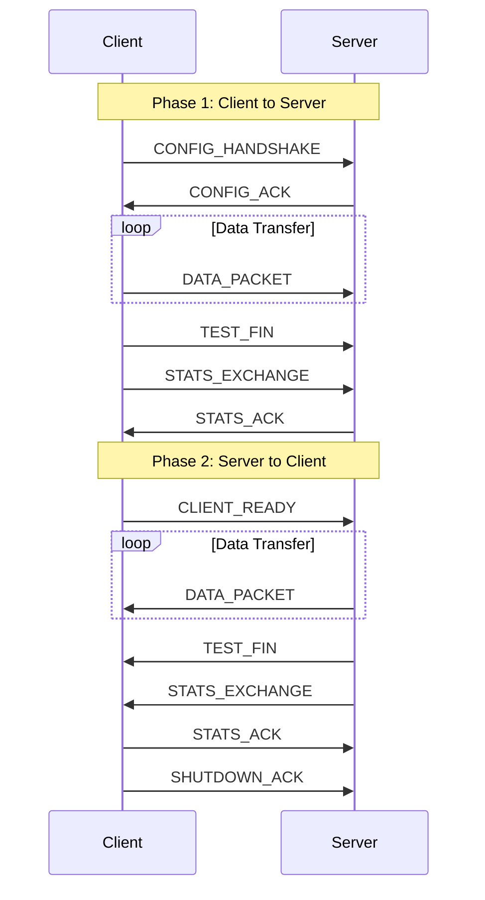
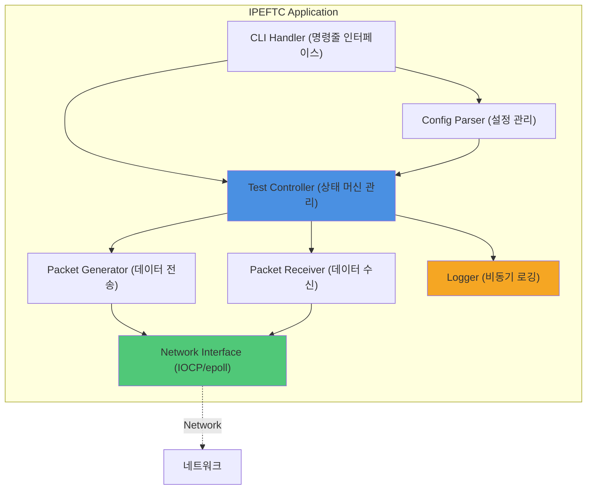
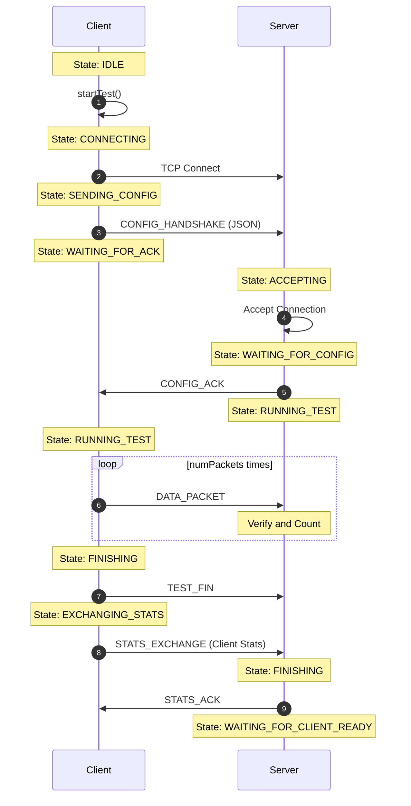
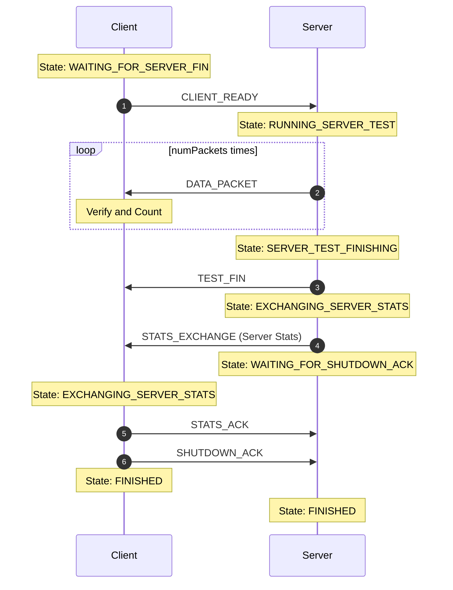
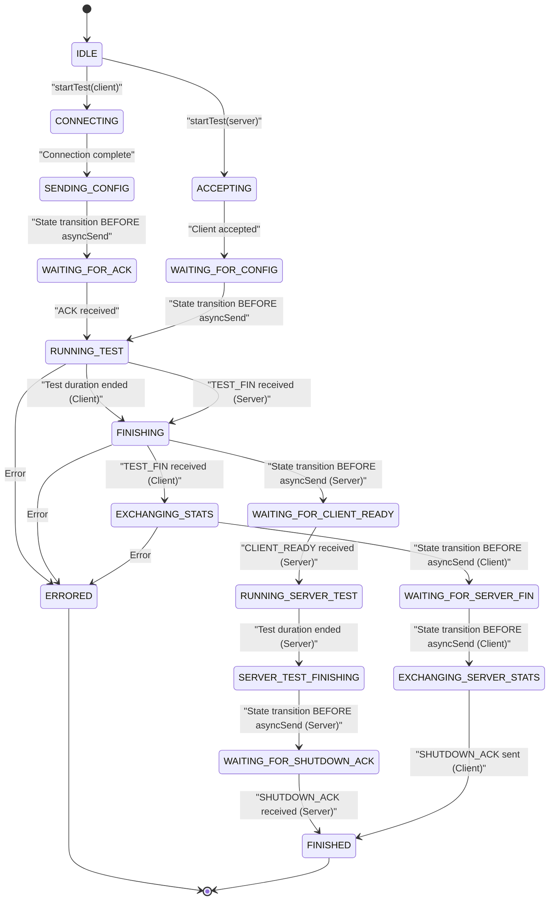

# MyIperf (IPEFTC) - 네트워크 성능 테스트 도구

> **IPEFTC** (IPerf Test Client/Server)는 iperf와 유사한 C++ 기반의 고성능 네트워크 처리량 측정 도구입니다.

[]()
[]()
[]()
[]()

---

## 📋 목차

- [개요](#개요)
- [주요 기능](#주요-기능)
- [시스템 아키텍처](#시스템-아키텍처)
- [빌드 방법](#-빌드-방법)
- [실행 방법](#-실행-방법)
- [명령줄 옵션](#-명령줄-옵션)
- [설정 파일](#-설정-파일)
- [프로토콜 상세](#-프로토콜-상세)
- [테스트 흐름](#-테스트-흐름)
- [성능 메트릭](#-성능-메트릭)
- [출력 결과 이해하기](#-출력-결과-이해하기)
- [고급 기능](#-고급-기능)
- [문제 해결](#-문제-해결)

---

## 개요

**IPEFTC**는 클라이언트-서버 모델을 사용하여 네트워크 처리량을 정밀하게 측정하는 도구입니다. 양방향 테스트를 통해 실제 네트워크 성능을 종합적으로 평가할 수 있으며, 체크섬 검증, 시퀀스 번호 추적, 패킷 손실 감지 등의 기능을 제공합니다.

### 주요 특징

- ✅ **크로스 플랫폼**: Windows (IOCP) 및 Linux (epoll) 완벽 지원
- ✅ **고성능 비동기 I/O**: 플랫폼별 최적화된 API 사용
- ✅ **양방향 테스트**: 단일 세션에서 클라이언트↔서버 양방향 처리량 측정
- ✅ **정교한 프로토콜**: 체크섬, 시퀀스 번호, 패킷 손실 감지
- ✅ **상세한 통계**: 로컬/원격 관점의 종합 보고서
- ✅ **유연한 설정**: CLI 또는 JSON 파일 지원
- ✅ **강력한 로깅**: 콘솔, 파일, Named Pipe (Windows) 지원

---

## 주요 기능

### 1. 크로스 플랫폼 지원

| 플랫폼 | 네트워크 API | 최적화 기술 |
|--------|-------------|------------|
| **Windows** | IOCP (I/O Completion Ports) | Zero-copy, Overlapped I/O |
| **Linux** | epoll | Edge-triggered, Non-blocking I/O |

### 2. 양방향 처리량 측정

IPEFTC는 단일 테스트 세션에서 두 단계로 나누어 양방향 성능을 측정합니다:


```mermaid
sequenceDiagram
    participant C as Client
    participant S as Server
    
    Note over C,S: Phase 1: Client to Server
    C->>S: CONFIG_HANDSHAKE
    S->>C: CONFIG_ACK
    loop Data Transfer
        C->>S: DATA_PACKET
    end
    C->>S: TEST_FIN
    C->>S: STATS_EXCHANGE
    S->>C: STATS_ACK
    
    Note over C,S: Phase 2: Server to Client
    C->>S: CLIENT_READY
    loop Data Transfer
        S->>C: DATA_PACKET
    end
    S->>C: TEST_FIN
    S->>C: STATS_EXCHANGE
    C->>S: STATS_ACK
    C->>S: SHUTDOWN_ACK
```

### 3. 정교한 패킷 검증

모든 데이터 패킷은 다음과 같은 검증 메커니즘을 포함합니다:

- **체크섬 검증**: 페이로드 무결성 확인
- **시퀀스 번호**: 패킷 순서 및 손실 감지
- **콘텐츠 검증**: 예상 페이로드와 실제 데이터 비교

---

## 시스템 아키텍처

### 컴포넌트 구조


```mermaid
graph TB
    subgraph APP [IPEFTC Application]
        CLI["CLI Handler (명령줄 인터페이스)"]
        TC["Test Controller (상태 머신 관리)"]
        PG["Packet Generator (데이터 전송)"]
        PR["Packet Receiver (데이터 수신)"]
        NI["Network Interface (IOCP/epoll)"]
        LOG["Logger (비동기 로깅)"]
        CFG["Config Parser (설정 관리)"]
    end
    
    CLI --> TC
    TC --> PG
    TC --> PR
    PG --> NI
    PR --> NI
    TC --> LOG
    CLI --> CFG
    CFG --> TC
    
    NI -.->|Network| NET["네트워크"]
    
    style TC fill:#4A90E2
    style NI fill:#50C878
    style LOG fill:#F5A623
```

### 핵심 클래스

| 클래스 | 역할 | 주요 메서드 |
|--------|------|-----------|
| `TestController` | 테스트 생명주기 관리 및 상태 머신 제어 | `startTest()`, `transitionTo()`, `onPacket()` |
| `PacketGenerator` | 데이터 패킷 생성 및 전송 | `start()`, `sendPacket()`, `stop()` |
| `PacketReceiver` | 데이터 패킷 수신 및 검증 | `onData()`, `verifyPacket()` |
| `WinIOCPNetworkInterface` | Windows IOCP 기반 네트워크 I/O | `asyncSend()`, `asyncReceive()` |
| `LinuxAsyncNetworkInterface` | Linux epoll 기반 네트워크 I/O | `asyncSend()`, `asyncReceive()` |
| `Logger` | 비동기 로깅 시스템 | `log()`, `start()`, `stop()` |
| `Config` | 설정 데이터 관리 | `toJson()`, `fromJson()` |

---

## 🔧 빌드 방법

### 사전 요구사항

- **CMake**: 3.15 이상
- **C++ 컴파일러**: C++17 지원 (MSVC, GCC, Clang)
- **Windows**: Visual Studio 2017 이상 (MSVC)
- **Linux**: GCC 7+ 또는 Clang 5+

### 빌드 단계

#### Windows (PowerShell)

```powershell
# 1. 프로젝트 디렉터리로 이동
cd MyIperf

# 2. 기존 빌드 디렉터리 제거 (선택사항)
Remove-Item .\build\ -Recurse -Force -ErrorAction SilentlyContinue

# 3. 빌드 디렉터리 생성
mkdir build
cd build

# 4. CMake 설정 생성
cmake ..

# 5. 릴리스 빌드
cmake --build . --config Release

# 6. 디버그 빌드 (선택사항)
cmake --build . --config Debug
```

#### Linux (Bash)

```bash
# 1. 프로젝트 디렉터리로 이동
cd MyIperf

# 2. 빌드 디렉터리 생성
mkdir -p build
cd build

# 3. CMake 설정 생성
cmake ..

# 4. 빌드
cmake --build . --config Release

# 또는 make 사용
make -j$(nproc)
```

### 빌드 출력

빌드가 성공하면 다음 위치에 실행 파일이 생성됩니다:

- **Windows**: `build\Release\IPEFTC.exe` 또는 `build\Debug\IPEFTC.exe`
- **Linux**: `build/IPEFTC`

---

## 🎮 실행 방법

### 기본 사용법

IPEFTC는 **서버 모드**와 **클라이언트 모드**로 실행됩니다. 테스트를 수행하려면 두 개의 터미널(또는 두 대의 컴퓨터)에서 각각 서버와 클라이언트를 실행해야 합니다.

### 서버 모드

서버는 클라이언트의 연결을 대기합니다.

```powershell
# Windows
.\build\Release\IPEFTC.exe --mode server --target 0.0.0.0 --port 5201 --save-logs true

# Linux
./build/IPEFTC --mode server --target 0.0.0.0 --port 5201 --save-logs true
```

**설명:**

- `--mode server`: 서버 모드로 실행
- `--target 0.0.0.0`: 모든 네트워크 인터페이스에서 수신 대기
- `--port 5201`: 포트 5201에서 수신 대기
- `--save-logs true`: 로그를 `Log` 디렉터리에 저장

### 클라이언트 모드

클라이언트는 서버에 연결하여 테스트를 시작합니다.

```powershell
# Windows - 로컬 테스트
.\build\Release\IPEFTC.exe --mode client --target 127.0.0.1 --port 5201 --packet-size 8192 --num-packets 10000 --save-logs true

# Linux - 원격 서버 테스트
./build/IPEFTC --mode client --target 192.168.1.100 --port 5201 --packet-size 8192 --num-packets 10000 --save-logs true
```

**설명:**

- `--mode client`: 클라이언트 모드로 실행
- `--target 127.0.0.1`: 서버 IP 주소 (로컬호스트)
- `--port 5201`: 서버 포트
- `--packet-size 8192`: 패킷 크기 8192 바이트 (헤더 포함)
- `--num-packets 10000`: 10,000개의 패킷 전송
- `--save-logs true`: 로그 저장

### 설정 파일 사용

JSON 설정 파일을 사용하여 실행할 수도 있습니다:

```powershell
# 서버
.\build\Release\IPEFTC.exe --mode server --config config_server.json

# 클라이언트
.\build\Release\IPEFTC.exe --mode client --config config_client.json
```

> **참고**: 명령줄 옵션이 설정 파일의 값을 재정의합니다.

---

## ⚙️ 명령줄 옵션

### 필수 옵션

| 옵션 | 값 | 설명 |
|------|-----|------|
| `--mode` | `client` \| `server` | **필수.** 작동 모드 지정 |

### 선택적 옵션

| 옵션 | 기본값 | 설명 |
|------|--------|------|
| `--config <path>` | - | JSON 설정 파일 경로 |
| `--target <ip>` | `127.0.0.1` | 대상 IP 주소 (클라이언트) 또는 바인드 IP (서버) |
| `--port <number>` | `5201` | 포트 번호 |
| `--packet-size <bytes>` | `8192` | 패킷 크기 (헤더 포함, 바이트) |
| `--num-packets <count>` | `10000` | 전송할 패킷 수 (0 = 무제한) |
| `--interval-ms <ms>` | `0` | 패킷 전송 간격 (밀리초, 0 = 연속) |
| `--save-logs <true\|false>` | `false` | 로그를 파일로 저장 |
| `-h, --help` | - | 도움말 표시 후 종료 |

### 옵션 상세 설명

#### `--packet-size`

- **범위**: 17 바이트 ~ 65535 바이트
- **권장값**: 1024, 2048, 4096, 8192, 16384
- **참고**: 실제 페이로드 크기 = packet-size - 17 (헤더 크기)

#### `--num-packets`

- **0**: 무제한 전송 (Ctrl+C로 중단)
- **양수**: 지정된 개수만큼 전송 후 자동 종료

#### `--interval-ms`

- **0**: 최대 속도로 연속 전송 (처리량 측정에 적합)
- **양수**: 지정된 간격으로 전송 (안정성 테스트에 적합)

---

## 📄 설정 파일

### 클라이언트 설정 예제 (`config_client.json`)

```json
{
    "mode": "CLIENT",
    "targetIP": "127.0.0.1",
    "port": 5201,
    "packetSize": 8192,
    "numPackets": 10000,
    "sendIntervalMs": 0,
    "protocol": "TCP",
    "saveLogs": true,
    "handshakeTimeoutMs": 5000
}
```

### 서버 설정 예제 (`config_server.json`)

```json
{
    "mode": "SERVER",
    "targetIP": "0.0.0.0",
    "port": 5201,
    "protocol": "TCP",
    "saveLogs": true,
    "handshakeTimeoutMs": 5000
}
```

### 설정 필드 설명

| 필드 | 타입 | 설명 |
|------|------|------|
| `mode` | String | `"CLIENT"` 또는 `"SERVER"` |
| `targetIP` | String | IP 주소 (클라이언트: 서버 IP, 서버: 바인드 IP) |
| `port` | Integer | 포트 번호 (1-65535) |
| `packetSize` | Integer | 패킷 크기 (바이트) |
| `numPackets` | Integer | 전송할 패킷 수 |
| `sendIntervalMs` | Integer | 전송 간격 (밀리초) |
| `protocol` | String | `"TCP"` (현재 TCP만 지원) |
| `saveLogs` | Boolean | 로그 파일 저장 여부 |
| `handshakeTimeoutMs` | Integer | 핸드셰이크 타임아웃 (밀리초) |

---

## 📡 프로토콜 상세

### 패킷 구조

모든 패킷은 17바이트 헤더와 가변 길이 페이로드로 구성됩니다:

```
┌──────────────┬──────────────┬──────────────┬──────────────┬──────────────┬──────────────┬──────────────┬──────────────┐
│  Start Code  │  Sender ID   │ Receiver ID  │ Message Type │Packet Counter│ Payload Size │   Checksum   │   Payload    │
│   (2 bytes)  │   (1 byte)   │   (1 byte)   │   (1 byte)   │  (4 bytes)   │  (4 bytes)   │  (4 bytes)   │  (variable)  │
└──────────────┴──────────────┴──────────────┴──────────────┴──────────────┴──────────────┴──────────────┴──────────────┘
      0xABCD         0/1           0/1         MessageType      Sequence#       Size          CRC32         Data...
```

### 헤더 필드 상세

| 필드 | 크기 | 타입 | 설명 |
|------|------|------|------|
| **Start Code** | 2 bytes | `uint16_t` | 고정값 `0xABCD`, 패킷 시작 식별자 |
| **Sender ID** | 1 byte | `uint8_t` | 송신자 ID (0=서버, 1=클라이언트) |
| **Receiver ID** | 1 byte | `uint8_t` | 수신자 ID (0=서버, 1=클라이언트) |
| **Message Type** | 1 byte | `MessageType` | 메시지 타입 (아래 참조) |
| **Packet Counter** | 4 bytes | `uint32_t` | 패킷 시퀀스 번호 (0부터 시작) |
| **Payload Size** | 4 bytes | `uint32_t` | 페이로드 크기 (바이트) |
| **Checksum** | 4 bytes | `uint32_t` | 페이로드 체크섬 (단순 합산) |
| **Payload** | Variable | `char[]` | 실제 데이터 |

### 메시지 타입

```cpp
enum class MessageType : uint8_t {
    CONFIG_HANDSHAKE = 0,  // 클라이언트 → 서버: 테스트 설정 전송
    CONFIG_ACK       = 1,  // 서버 → 클라이언트: 설정 확인
    DATA_PACKET      = 2,  // 양방향: 실제 데이터 패킷
    STATS_EXCHANGE   = 3,  // 양방향: 통계 정보 교환
    STATS_ACK        = 4,  // 양방향: 통계 수신 확인
    TEST_FIN         = 5,  // 양방향: 테스트 단계 완료 신호
    CLIENT_READY     = 6,  // 클라이언트 → 서버: Phase 2 준비 완료
    SHUTDOWN_ACK     = 7   // 클라이언트 → 서버: 최종 종료 확인
};
```

### 체크섬 계산

```cpp
uint32_t calculateChecksum(const char* data, size_t size) {
    uint32_t sum = 0;
    for (size_t i = 0; i < size; ++i) {
        sum += static_cast<unsigned char>(data[i]);
    }
    return sum;
}
```

### 페이로드 생성

데이터 패킷의 페이로드는 검증 가능한 결정적 패턴으로 생성됩니다:

```cpp
std::string buildExpectedPayload(uint32_t packetCounter, size_t payloadSize) {
    std::string payload = "Packet " + std::to_string(packetCounter);
    if (payload.size() < payloadSize) 
        payload.resize(payloadSize, '.');
    else 
        payload.resize(payloadSize);
    return payload;
}
```

**예시:**

- Packet 0: `"Packet 0......."`
- Packet 1: `"Packet 1......."`
- Packet 100: `"Packet 100....."`

---

## 🔄 테스트 흐름

### 전체 테스트 프로세스

IPEFTC는 두 단계(Phase)로 나누어 양방향 성능을 측정합니다:

#### Phase 1: Client → Server


```mermaid
sequenceDiagram
    autonumber
    participant C as Client
    participant S as Server
    
    Note over C: State: IDLE
    C->>C: startTest()
    Note over C: State: CONNECTING
    C->>S: TCP Connect
    Note over C: State: SENDING_CONFIG
    C->>S: CONFIG_HANDSHAKE (JSON)
    Note over C: State: WAITING_FOR_ACK
    
    Note over S: State: ACCEPTING
    S->>S: Accept Connection
    Note over S: State: WAITING_FOR_CONFIG
    S->>C: CONFIG_ACK
    Note over S: State: RUNNING_TEST
    
    Note over C: State: RUNNING_TEST
    loop numPackets times
        C->>S: DATA_PACKET
        Note over S: Verify and Count
    end
    
    Note over C: State: FINISHING
    C->>S: TEST_FIN
    Note over C: State: EXCHANGING_STATS
    C->>S: STATS_EXCHANGE (Client Stats)
    
    Note over S: State: FINISHING
    S->>C: STATS_ACK
    Note over S: State: WAITING_FOR_CLIENT_READY
```

#### Phase 2: Server to Client


```mermaid
sequenceDiagram
    autonumber
    participant C as Client
    participant S as Server
    
    Note over C: State: WAITING_FOR_SERVER_FIN
    C->>S: CLIENT_READY
    
    Note over S: State: RUNNING_SERVER_TEST
    loop numPackets times
        S->>C: DATA_PACKET
        Note over C: Verify and Count
    end
    
    Note over S: State: SERVER_TEST_FINISHING
    S->>C: TEST_FIN
    Note over S: State: EXCHANGING_SERVER_STATS
    S->>C: STATS_EXCHANGE (Server Stats)
    Note over S: State: WAITING_FOR_SHUTDOWN_ACK
    
    Note over C: State: EXCHANGING_SERVER_STATS
    C->>S: STATS_ACK
    C->>S: SHUTDOWN_ACK
    Note over C: State: FINISHED
    
    Note over S: State: FINISHED
```

### 상태 머신

TestController는 엄격한 상태 머신을 따릅니다:


```mermaid
stateDiagram-v2
    [*] --> IDLE
    
    IDLE --> CONNECTING: "startTest(client)"
    IDLE --> ACCEPTING: "startTest(server)"
    
    CONNECTING --> SENDING_CONFIG: "Connection complete"
    SENDING_CONFIG --> WAITING_FOR_ACK: "State transition BEFORE asyncSend"
    WAITING_FOR_ACK --> RUNNING_TEST: "ACK received"
    
    ACCEPTING --> WAITING_FOR_CONFIG: "Client accepted"
    WAITING_FOR_CONFIG --> RUNNING_TEST: "State transition BEFORE asyncSend"
    
    RUNNING_TEST --> FINISHING: "Test duration ended (Client)"
    RUNNING_TEST --> FINISHING: "TEST_FIN received (Server)"
    
    FINISHING --> EXCHANGING_STATS: "TEST_FIN received (Client)"
    FINISHING --> WAITING_FOR_CLIENT_READY: "State transition BEFORE asyncSend (Server)"
    
    EXCHANGING_STATS --> WAITING_FOR_SERVER_FIN: "State transition BEFORE asyncSend (Client)"
    
    WAITING_FOR_CLIENT_READY --> RUNNING_SERVER_TEST: "CLIENT_READY received (Server)"
    RUNNING_SERVER_TEST --> SERVER_TEST_FINISHING: "Test duration ended (Server)"
    
    WAITING_FOR_SERVER_FIN --> EXCHANGING_SERVER_STATS: "State transition BEFORE asyncSend (Client)"
    SERVER_TEST_FINISHING --> WAITING_FOR_SHUTDOWN_ACK: "State transition BEFORE asyncSend (Server)"
    
    WAITING_FOR_SHUTDOWN_ACK --> FINISHED: "SHUTDOWN_ACK received (Server)"
    EXCHANGING_SERVER_STATS --> FINISHED: "SHUTDOWN_ACK sent (Client)"
    
    RUNNING_TEST --> ERRORED: Error
    FINISHING --> ERRORED: Error
    EXCHANGING_STATS --> ERRORED: Error
    
    ERRORED --> [*]
    FINISHED --> [*]
```

### 핵심 설계 원칙

> [!IMPORTANT]
> **상태 전이 우선 (State Transition First)**
>
> 모든 비동기 메시지 전송(`asyncSend`) **전에** 상태 전이를 완료하여 race condition을 방지합니다.

1. **상태 전이 우선**: `asyncSend` 호출 전 상태 변경 완료
2. **Graceful Shutdown**: `SHUTDOWN_ACK`를 통한 안전한 종료
3. **스레드 안전성**: `transitionTo_nolock` 사용으로 데드락 방지
4. **견고한 핸드셰이크**: 각 단계에서 명시적 동기화

---

## 📊 성능 메트릭

### 측정 항목

IPEFTC는 각 테스트 단계에서 다음 메트릭을 수집합니다:

| 메트릭 | 설명 | 단위 | 계산 방법 |
|--------|------|------|----------|
| **Total Bytes Sent** | 전송된 총 바이트 (헤더 포함) | Bytes | 누적 합산 |
| **Total Packets Sent** | 전송된 총 패킷 수 | Count | 누적 카운트 |
| **Total Bytes Received** | 수신된 총 바이트 (헤더 포함) | Bytes | 누적 합산 |
| **Total Packets Received** | 수신된 총 패킷 수 | Count | 누적 카운트 |
| **Duration** | 테스트 지속 시간 | Seconds | 종료 시간 - 시작 시간 |
| **Throughput** | 처리량 | Mbps | `(Bytes × 8) / (Duration × 1,000,000)` |
| **Failed Checksum Count** | 체크섬 오류 수 | Count | 검증 실패 카운트 |
| **Sequence Error Count** | 시퀀스 오류 수 | Count | 순서 불일치 카운트 |
| **Content Mismatch Count** | 콘텐츠 불일치 수 | Count | 페이로드 검증 실패 |

### 처리량 계산 공식

$$
\text{Throughput (Mbps)} = \frac{\text{Total Bytes Received} \times 8}{\text{Duration (seconds)} \times 1,000,000}
$$

**예시:**

- Total Bytes Received: 81,920,000 bytes
- Duration: 10.5 seconds
- Throughput: `(81,920,000 × 8) / (10.5 × 1,000,000)` = **62.4 Mbps**

### 통계 데이터 구조

```cpp
struct TestStats {
    long long totalBytesSent;           // 전송된 총 바이트
    long long totalPacketsSent;         // 전송된 총 패킷
    long long totalBytesReceived;       // 수신된 총 바이트
    long long totalPacketsReceived;     // 수신된 총 패킷
    long long failedChecksumCount;      // 체크섬 오류 수
    long long sequenceErrorCount;       // 시퀀스 오류 수
    long long contentMismatchCount;     // 콘텐츠 불일치 수
    double duration;                    // 지속 시간 (초)
    double throughputMbps;              // 처리량 (Mbps)
};
```

---

## 📈 출력 결과 이해하기

### 최종 보고서 구조

테스트 완료 후, 클라이언트와 서버 모두 상세한 보고서를 출력합니다:

```
===============================================================================
                           FINAL TEST REPORT
===============================================================================

Phase 1: Client → Server Data Transfer
-------------------------------------------------------------------------------
Local (Client) Transmission Statistics:
  Total Bytes Sent:     81,920,000 bytes
  Total Packets Sent:   10,000 packets
  Duration:             10.234 seconds
  Throughput:           64.05 Mbps

Remote (Server) Reception Statistics:
  Total Bytes Received: 81,920,000 bytes
  Total Packets Received: 10,000 packets
  Duration:             10.234 seconds
  Throughput:           64.05 Mbps
  Checksum Errors:      0
  Sequence Errors:      0
  Content Mismatches:   0

Phase 2: Server → Client Data Transfer
-------------------------------------------------------------------------------
Remote (Server) Transmission Statistics:
  Total Bytes Sent:     81,920,000 bytes
  Total Packets Sent:   10,000 packets
  Duration:             10.189 seconds
  Throughput:           64.34 Mbps

Local (Client) Reception Statistics:
  Total Bytes Received: 81,920,000 bytes
  Total Packets Received: 10,000 packets
  Duration:             10.189 seconds
  Throughput:           64.34 Mbps
  Checksum Errors:      0
  Sequence Errors:      0
  Content Mismatches:   0

===============================================================================
Test completed successfully with no errors.
===============================================================================
```

### 결과 해석

#### ✅ 정상 테스트

- **Sent == Received**: 모든 바이트와 패킷이 정상 전송됨
- **Errors == 0**: 체크섬, 시퀀스, 콘텐츠 오류 없음
- **Throughput 일관성**: 양방향 처리량이 유사함

#### ⚠️ 문제 발생 시

| 증상 | 원인 | 해결 방법 |
|------|------|----------|
| **Checksum Errors > 0** | 네트워크 데이터 손상 | 네트워크 케이블/스위치 점검 |
| **Sequence Errors > 0** | 패킷 손실 또는 재정렬 | 네트워크 혼잡도 확인 |
| **Sent ≠ Received** | 패킷 손실 | 방화벽/라우터 설정 확인 |
| **Throughput 낮음** | 네트워크 병목 | 대역폭 확인, packet-size 조정 |

---

## 🔬 고급 기능

### 1. 로깅 시스템

IPEFTC는 다층 비동기 로깅을 지원합니다:

#### 로그 출력 대상

| 대상 | 설명 | 활성화 방법 |
|------|------|-----------|
| **콘솔** | 표준 출력 (stdout) | 항상 활성화 |
| **파일** | `Log/IPEFTC_YYYYMMDD_HHMMSS.log` | `--save-logs true` |
| **Named Pipe** (Windows) | `\\.\pipe\IPEFTCLogPipe` | 컴파일 시 `DEBUG_PIPE` 정의 |

#### 로그 레벨

```cpp
Logger::log("Info: 정보 메시지");
Logger::log("Warning: 경고 메시지");
Logger::log("Error: 오류 메시지");
```

### 2. JSON 기반 통계 교환

통계 데이터는 JSON 형식으로 직렬화되어 교환됩니다:

```json
{
    "totalBytesSent": 81920000,
    "totalPacketsSent": 10000,
    "totalBytesReceived": 81920000,
    "totalPacketsReceived": 10000,
    "failedChecksumCount": 0,
    "sequenceErrorCount": 0,
    "contentMismatchCount": 0,
    "duration": 10.234,
    "throughputMbps": 64.05
}
```

### 3. 핸드셰이크 타임아웃

클라이언트는 `CONFIG_ACK` 대기 시 타임아웃을 설정할 수 있습니다:

```json
{
    "handshakeTimeoutMs": 5000
}
```

타임아웃 발생 시 에러 상태로 전이하고 연결을 종료합니다.

### 4. 무제한 전송 모드

`--num-packets 0`으로 설정하면 Ctrl+C로 중단할 때까지 계속 전송합니다:

```powershell
.\build\Release\IPEFTC.exe --mode client --target 127.0.0.1 --port 5201 --num-packets 0
```

> [!CAUTION]
> 무제한 모드에서는 수동으로 중단해야 하며, 통계 교환이 정상적으로 이루어지지 않을 수 있습니다.

---

## 🛠️ 문제 해결

### 일반적인 문제

#### 1. 연결 실패

**증상:**

```
Error: Failed to connect to 127.0.0.1:5201
```

**해결 방법:**

- 서버가 먼저 실행 중인지 확인
- 포트 번호가 일치하는지 확인
- 방화벽 설정 확인 (Windows Defender, iptables)
- 서버 IP 주소가 올바른지 확인

#### 2. 포트 이미 사용 중

**증상:**

```
Error: Failed to bind to 0.0.0.0:5201 (Address already in use)
```

**해결 방법:**

```powershell
# Windows: 포트 사용 프로세스 확인
netstat -ano | findstr :5201
taskkill /PID <PID> /F

# Linux: 포트 사용 프로세스 확인
sudo lsof -i :5201
sudo kill -9 <PID>
```

#### 3. 체크섬 오류 발생

**증상:**

```
Checksum Errors: 150
```

**원인:**

- 네트워크 케이블 불량
- 스위치/라우터 하드웨어 문제
- 네트워크 드라이버 오류

**해결 방법:**

- 네트워크 케이블 교체
- 다른 네트워크 인터페이스 사용
- 네트워크 드라이버 업데이트

#### 4. 낮은 처리량

**증상:**

```
Throughput: 5.2 Mbps (예상: 100 Mbps)
```

**해결 방법:**

- `--packet-size` 증가 (예: 16384, 32768)
- `--interval-ms 0` 설정 (연속 전송)
- 네트워크 대역폭 확인
- CPU 사용률 확인 (다른 프로세스가 리소스 점유 중인지)

### 디버그 모드

디버그 빌드를 사용하여 상세한 로그를 확인할 수 있습니다:

```powershell
# 디버그 빌드
cmake --build . --config Debug

# 실행
.\build\Debug\IPEFTC.exe --mode server --target 0.0.0.0 --port 5201 --save-logs true
```

### 로그 파일 위치

로그 파일은 실행 파일과 동일한 디렉터리의 `Log` 폴더에 저장됩니다:

```
MyIperf/
├── build/
│   └── Release/
│       ├── IPEFTC.exe
│       └── Log/
│           ├── IPEFTC_20231224_150630.log  (클라이언트)
│           └── IPEFTC_20231224_150625.log  (서버)
```

---

## 📚 추가 리소스

### 관련 프로젝트

| 프로젝트 | 설명 |
|---------|------|
| **TestRunner** | 단일 머신에서 자동화된 반복 테스트 실행 |
| **TestRunner_local** | 로컬 프로세스 간 테스트 자동화 |
| **TestRunner_Remote** | 원격 머신 간 네트워크 테스트 자동화 |

### 성능 최적화 팁

1. **패킷 크기 조정**: 대역폭이 높은 네트워크에서는 큰 패킷 사용 (16KB ~ 32KB)
2. **연속 전송**: `--interval-ms 0`으로 최대 처리량 측정
3. **릴리스 빌드**: 항상 Release 빌드 사용 (최대 3배 성능 향상)
4. **CPU 친화성**: 멀티코어 시스템에서 특정 코어에 바인딩

### 알려진 제한사항

> [!NOTE]
> **현재 제한사항**
>
> - TCP만 지원 (UDP는 미구현)
> - IPv4만 지원 (IPv6는 미구현)
> - 단일 연결만 지원 (다중 연결 미지원)

---

## 📝 라이선스

이 프로젝트는 MIT 라이선스 하에 배포됩니다.

---

## 👥 기여

버그 리포트, 기능 제안, 풀 리퀘스트를 환영합니다!

---

## 📞 문의

문제가 발생하거나 질문이 있으시면 이슈를 등록해 주세요.

---

**마지막 업데이트**: 2024-12-24
