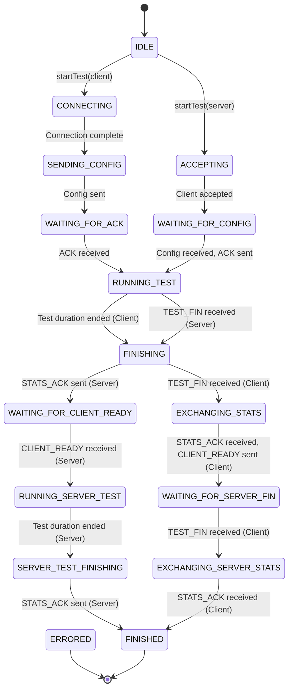

# MyIperf (IPEFTC)

iperf와 유사한 C++ 기반 네트워크 성능 테스트 도구입니다. 클라이언트-서버 모델을 사용하여 네트워크 처리량을 측정합니다. 이 프로젝트는 CMake를 사용하여 빌드되었으며 Windows (IOCP)와 Linux (epoll)를 모두 지원합니다.

## 기능

-   크로스 플랫폼 지원 (Windows 및 Linux).
-   플랫폼별 API(Windows의 IOCP, Linux의 epoll)를 사용한 고성능 비동기 I/O.
-   네트워크 처리량 측정을 위한 클라이언트-서버 아키텍처.
-   명령줄 또는 JSON 파일을 통해 테스트 매개변수(패킷 크기, 패킷 수, 전송 간격)를 설정할 수 있습니다.
-   2단계 테스트: 단일 세션에서 클라이언트-서버 및 서버-클라이언트 처리량을 모두 측정합니다.
-   로컬 및 원격 관점의 통계를 포함한 상세한 최종 보고서.
-   콘솔, 파일 및 명명된 파이프(Windows)에 비동기 로깅.

## 빌드 방법

1.  **빌드 디렉터리 생성:**
    ```shell
    cd D:\01_SW2_Project\MyIperf
    Remove-Item .\build\ -Recurse -Force -ErrorAction Stop
    mkdir build
    cd build
    ```

2.  **CMake로 빌드 파일 생성:**
    ```shell
    cmake ..
    ```

3.  **프로젝트 빌드:**
    *   생성된 `.sln` 파일을 Visual Studio에서 열고 컴파일할 수 있습니다.
    *   또는 명령줄에서 빌드할 수 있습니다 (예: 릴리스 모드):
        ```shell
        cmake --build . --config Release
        ```

## 실행 방법

### 서버 모드

수신 대기할 IP와 포트를 지정하여 서버 모드에서 실행 파일을 실행합니다.

```shell
# 디버그 빌드
.\build\Debug\IPEFTC.exe --mode server --target 0.0.0.0 --port 5201 --save-logs true

# 릴리스 빌드
.\build\Release\IPEFTC.exe --mode server --target 0.0.0.0 --port 5201 --save-logs true
```

### 클라이언트 모드

서버의 IP와 포트 및 기타 테스트 매개변수를 지정하여 클라이언트 모드에서 실행 파일을 실행합니다.

```shell
# 디버그 빌드
.\build\Debug\IPEFTC.exe --mode client --target 127.0.0.1 --port 5201 --packet-size 8192 --num-packets 10000 --save-logs true

# 릴리스 빌드
.\build\Release\IPEFTC.exe --mode client --target 127.0.0.1 --port 5201 --packet-size 8192 --num-packets 10000 --save-logs true
```

## 명령줄 옵션

| 옵션 | 설명 |
|---|---|
| `--mode <client|server>` | **필수.** 작동 모드를 지정합니다. |
| `--config <path>` | JSON 설정 파일의 경로. 명령줄 옵션이 파일 설정을 재정의합니다. |
| `--target <ip_address>` | 클라이언트의 대상 IP 주소. |
| `--port <port_number>` | 연결을 위한 포트 번호. |
| `--packet-size <bytes>` | 데이터 패킷의 크기 (바이트 단위, 헤더 포함). |
| `--num-packets <count>` | 보낼 패킷 수 (0은 무제한). |
| `--interval-ms <ms>` | 패킷 전송 간 지연 시간 (밀리초, 0은 연속 전송). |
| `--save-logs <true|false>`| 콘솔 로그를 'Log' 디렉터리에 파일로 저장합니다. |
| `-h, --help` | 도움말 메시지를 표시하고 종료합니다. |

## 최종 보고서 이해하기

최종 보고서는 두 단계로 나뉘며, 각 단계는 로컬 및 원격 시스템 관점의 통계를 보여줍니다.

-   **1단계: 클라이언트에서 서버로**: 클라이언트가 서버로 데이터를 보냅니다.
-   **2단계: 서버에서 클라이언트로**: 서버가 클라이언트로 데이터를 보냅니다.

### 주요 메트릭

-   **Total Bytes**: 패킷 헤더를 포함하여 전송된 총 바이트.
-   **Total Packets**: 전송된 총 데이터 패킷 수.
-   **Duration (s)**: 테스트의 데이터 전송 단계에 소요된 총 시간.
-   **Throughput (Mbps)**: 초당 메가비트로 계산된 데이터 전송 속도. 공식: `(Total Bytes * 8) / (Duration * 1,000,000)`.
-   **Checksum/Sequence Errors**: 전송 중 발생할 수 있는 패킷 손상 또는 손실을 나타냅니다.

---
## 프로토콜 흐름 및 상태 머신

애플리케이션은 테스트 생명주기를 관리하기 위해 엄격한 상태 머신을 따릅니다. 주요 상태와 전환은 아래 다이어그램에 나와 있습니다. 최근 `TEST_FIN` 핸드셰이크가 추가되어 클라이언트와 서버가 최종 통계를 교환하기 전에 데이터 전송 단계를 완료했는지 확인합니다.

