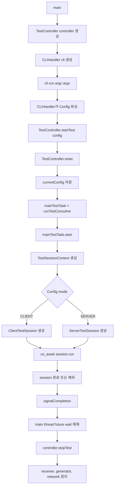
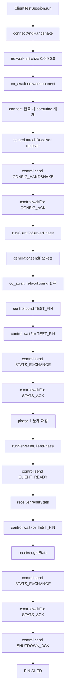
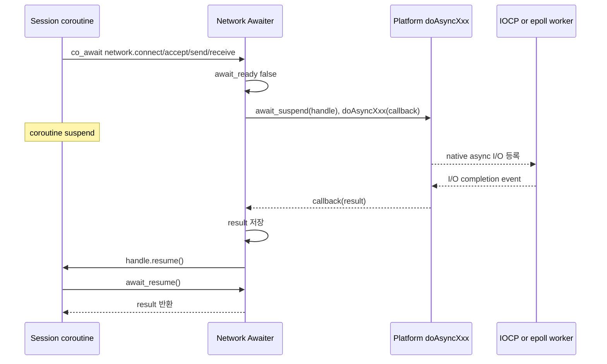
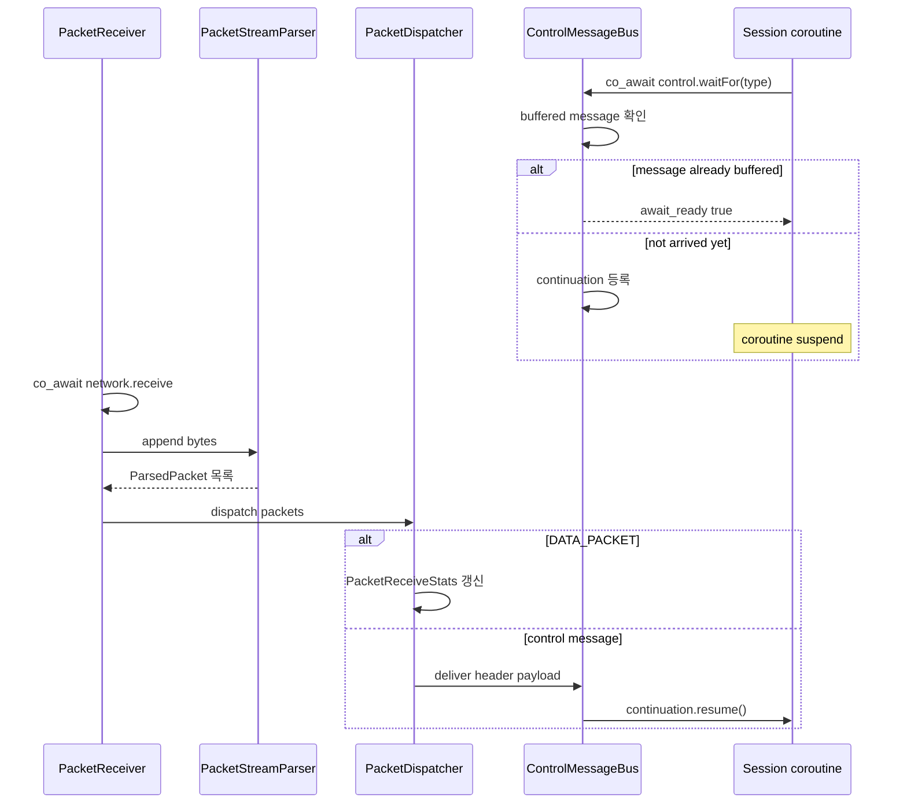
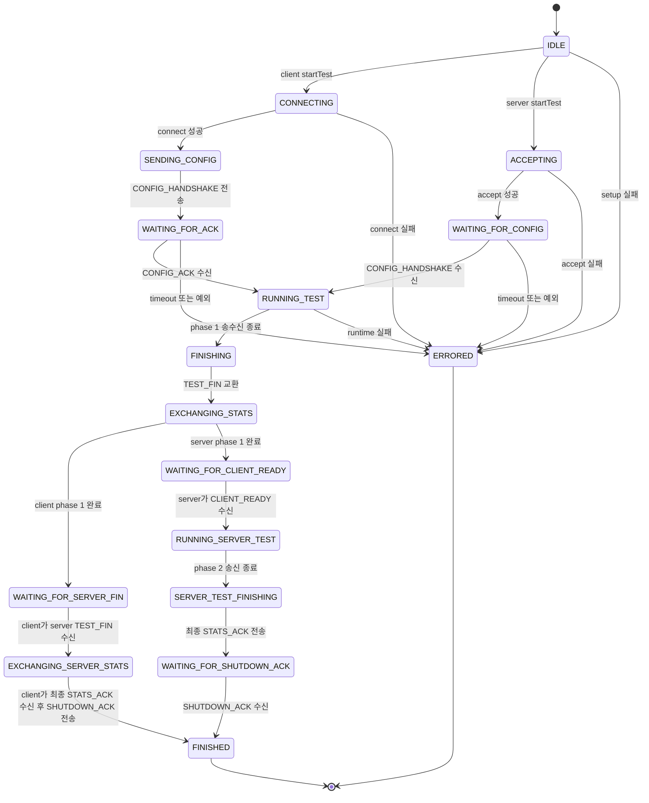

# 실행 흐름 다이어그램

이 문서는 MyIperf의 전체 실행 흐름과 coroutine 대기 지점을 요약한다. 상위 흐름은
`co_await` 덕분에 순차 코드처럼 보이지만, 실제 네트워크 I/O와 제어 메시지 대기는
awaiter가 coroutine handle을 저장했다가 완료 시점에 `resume()`하는 방식으로 동작한다.

## 프로그램 시작과 테스트 시작

## Client session 흐름

## Server session 흐름

```mermaid
flowchart TD
    A[ServerTestSession.run] --> B[acceptAndReceiveConfig]
    B --> C[network.prepareServer]
    C --> D[co_await network.accept]
    D --> E[accept 완료 시 coroutine 재개]
    E --> F[control.attachReceiver receiver]
    F --> G[control.waitFor CONFIG_HANDSHAKE]
    G --> H[Config payload 적용]
    H --> I[control.send CONFIG_ACK]
    I --> J[runClientToServerPhase]

    J --> K[receiver.resetStats]
    K --> L[control.waitFor TEST_FIN]
    L --> M[control.send TEST_FIN]
    M --> N[control.waitFor STATS_EXCHANGE]
    N --> O[receiver.getStats]
    O --> P[control.send STATS_ACK]
    P --> Q[runServerToClientPhase]

    Q --> R[control.waitFor CLIENT_READY]
    R --> S[generator.resetStats]
    S --> T[generator.sendPackets]
    T --> U[co_await network.send 반복]
    U --> V[control.send TEST_FIN]
    V --> W[control.waitFor STATS_EXCHANGE]
    W --> X[generator.getStats]
    X --> Y[control.send STATS_ACK]
    Y --> Z[control.waitFor SHUTDOWN_ACK]
    Z --> AA[FINISHED]
```

## 네트워크 awaiter 재개 흐름

## Control message 수신/대기 흐름

## TestController 상태 전이

## 읽을 때 중요한 점

- `control.waitFor`는 메시지가 이미 도착해 있으면 즉시 통과하고, 없으면 coroutine handle을 저장한다.
- `PacketReceiver`는 background receive loop를 돌며 `DATA_PACKET`은 통계로, control message는 `ControlMessageBus`로 보낸다.
- `ControlMessageBus::deliver`는 대기 중인 coroutine이 있으면 lock 밖에서 `resume()`한다.
- `network.connect/accept/send/receive`는 상위 API이고, 실제 platform I/O는 `doAsyncXxx`와 worker thread가 처리한다.
- session coroutine은 실패 시 예외를 던지고, `TestController::runTestCoroutine`이 잡아 `ERRORED`로 전이한다.
- `INITIALIZING` state enum은 존재하지만 현재 코드에서는 명시적으로 전이하지 않는다.
