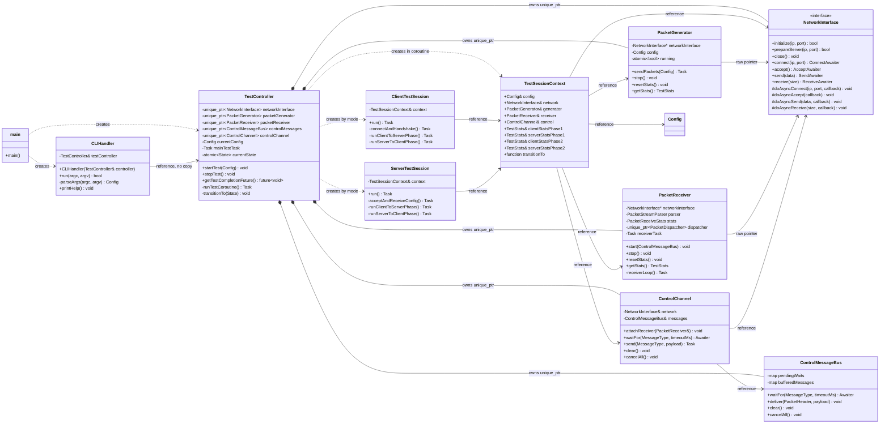
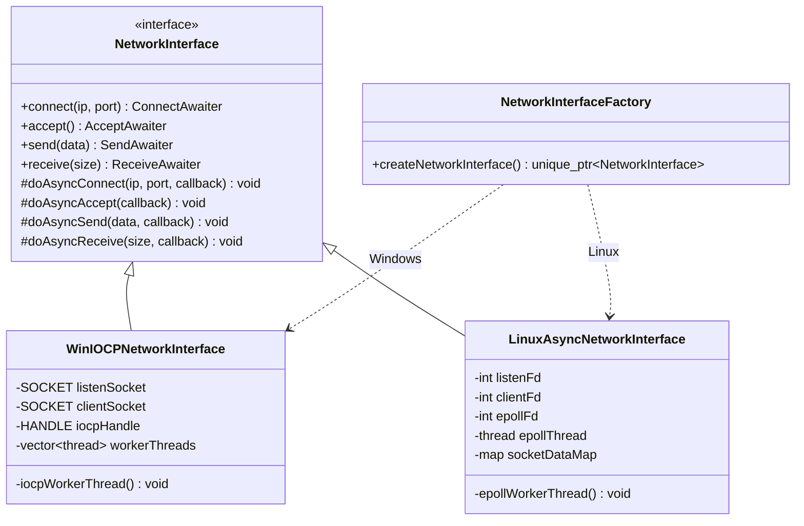
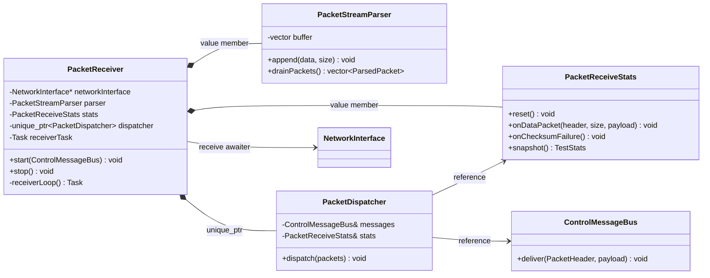
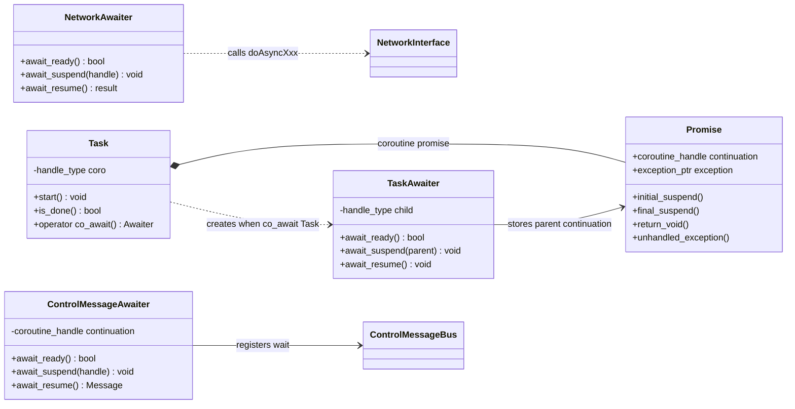

# 클래스 다이어그램

이 문서는 MyIperf의 전체 객체 관계를 코드 이해용으로 요약한다. 핵심은
`TestController`가 실행에 필요한 객체를 소유하고, session 객체들은
`TestSessionContext`를 통해 그 객체들을 참조로 빌려 쓴다는 점이다.

## 관계 표기

- `*--`: 소유 관계. `unique_ptr` 또는 값 멤버처럼 lifetime을 관리한다.
- `-->`: 참조 또는 raw pointer 관계. 객체를 빌려 쓰며 소유하지 않는다.
- `..>`: 생성, 호출, 일시적 의존 관계.
- `Task`는 coroutine frame handle을 소유한다.
- `Awaiter`는 handle을 빌려 `co_await` 중인 parent coroutine과 child coroutine을 연결한다.

## 전체 객체 소유/참조 구조

## 네트워크 플랫폼 구현

`NetworkInterface`는 상위 coroutine 코드가 사용하는 공통 API를 제공한다. 실제 I/O는
플랫폼 구현체의 protected backend hook인 `doAsyncXxx`에서 처리한다.

## 패킷 수신 처리 구조

`PacketReceiver`는 수신 coroutine lifecycle만 담당한다. byte stream 조립, 검증,
통계 갱신, 제어 메시지 전달은 별도 클래스로 나뉜다.

## Coroutine 지원 구조

`Task`는 MyIperf session 흐름을 순차 코드처럼 읽게 해주는 최소 coroutine runtime이다.
`NetworkInterface` awaiter와 `ControlMessageBus::Awaiter`는 외부 이벤트가 완료될 때
저장해 둔 coroutine handle을 `resume()`한다.

## 읽을 때 중요한 점

- `CLIHandler`는 `TestController`를 복사하지 않고 참조한다.
- `TestController`가 네트워크, 송신기, 수신기, 제어 메시지 버스를 소유한다.
- `TestSessionContext`는 소유자가 아니라 session에 필요한 참조를 묶어 전달하는 구조체다.
- `PacketGenerator`와 `PacketReceiver`의 `NetworkInterface*`는 소유권이 없는 raw pointer다.
- `ControlChannel`은 session 코드가 `send`와 `waitFor`를 쉽게 쓰도록 만든 facade다.
- `doAsyncXxx` callback은 platform 내부 구현 세부사항이며, 상위 테스트 흐름은 `co_await` 중심으로 읽힌다.
