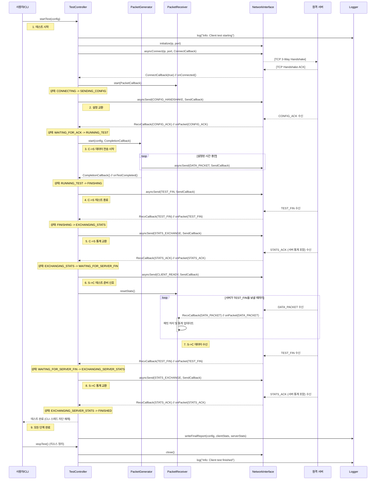

# 클라이언트 측 시퀀스 다이어그램

이 문서는 `MyIperf` 클라이언트의 내부 구성 요소 간의 상호 작용 순서를 시작부터 테스트 완료까지 보여줍니다.

## 핵심 설계 원칙

### 상태 전이 타이밍
모든 `asyncSend` 호출 **전에** 상태 전이를 수행하여 race condition을 방지합니다:
- ✅ `transitionTo_nolock(NewState)` → `asyncSend(packet)`
- ❌ `asyncSend(packet)` → 콜백에서 `transitionTo(NewState)`

### PacketGenerator 스레드 관리
- 각 `start()` 호출 시 이전 스레드를 완전히 정리 (`joinable()` 체크 및 `join()`)
- `running` 플래그를 강제 리셋하여 재시작 보장
- 스레드 생성 성공 시 명시적 로깅

## 1. 다이어그램

## 2. 순서 설명

1.  **테스트 시작**: 사용자가 CLI 명령을 실행하면 `CLIHandler`가 `TestController.startTest()`를 호출합니다.

2.  **연결 및 설정 교환**:
    *   `TestController`는 `NetworkInterface`를 초기화하고 `asyncConnect()`를 호출합니다.
    *   연결에 성공하면(`onConnected` 콜백) `PacketReceiver`를 시작하고 서버에 `CONFIG_HANDSHAKE` 메시지를 보냅니다.
    *   서버의 `CONFIG_ACK`가 수신되면 상태가 `RUNNING_TEST`로 전환됩니다.

3.  **1단계: 클라이언트-서버 데이터 전송**:
    *   `TestController`가 `PacketGenerator`를 시작합니다.
    *   `PacketGenerator`는 설정된 시간 동안 계속해서 `DATA_PACKET`을 보냅니다.

4.  **C->S 테스트 종료**:
    *   시간이 만료되면 `PacketGenerator`가 `onTestCompleted` 콜백을 호출합니다.
    *   `TestController`는 데이터 전송 단계의 종료를 알리기 위해 서버에 `TEST_FIN` 메시지를 보냅니다.

5.  **C->S 통계 교환**:
    *   클라이언트는 핸드셰이크를 완료하기 위해 서버의 `TEST_FIN`을 기다립니다.
    *   그런 다음 `TestController`는 자체 테스트 통계를 `STATS_EXCHANGE` 메시지로 보냅니다.
    *   서버로부터 1단계에 대한 서버의 통계가 포함된 `STATS_ACK`를 수신합니다.

6.  **2단계 준비 신호**:
    *   클라이언트는 서버에 `CLIENT_READY` 메시지를 보냅니다.
    *   다가오는 서버-클라이언트 전송을 측정하기 위해 `PacketReceiver` 통계를 재설정합니다.

7.  **2단계: 서버-클라이언트 데이터 전송**:
    *   클라이언트의 `PacketReceiver`가 이제 서버에서 보낸 `DATA_PACKET`을 수신하기 시작합니다.
    *   이는 서버가 완료를 알릴 때까지 계속됩니다.

8.  **S->C 통계 교환**:
    *   클라이언트는 서버로부터 `TEST_FIN`을 수신하여 두 번째 데이터 전송 단계를 종료합니다.
    *   `TestController`는 `PacketReceiver`의 통계를 최종 `STATS_EXCHANGE` 메시지로 보냅니다.
    *   서버로부터 2단계에 대한 서버의 전송 통계가 포함된 최종 `STATS_ACK`를 수신합니다.

9.  **최종 종료**:
    *   `TestController`는 이제 `FINISHED` 상태입니다. 주 CLI 스레드의 차단을 해제합니다.
    *   `stopTest()`가 호출되어 모든 네트워크 리소스를 정리하고 프로그램이 종료됩니다.
