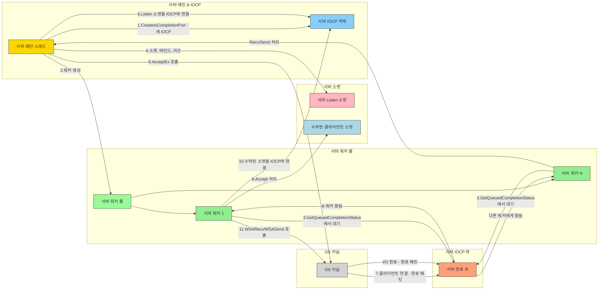
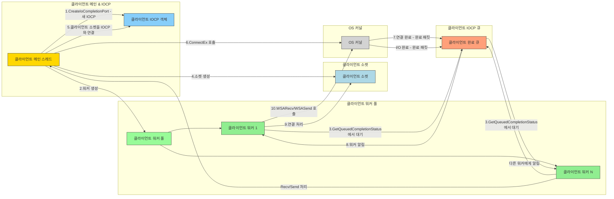

# IOCP (I/O Completion Port) 상세 설명

IOCP는 고성능 I/O 작업을 위해 Windows OS에서 제공하는 핵심 커널 객체 및 프로그래밍 모델입니다. 이 문서는 IOCP의 핵심 개념을 설명하고 서버 및 클라이언트 컨텍스트에서의 사용법을 자세히 설명하며 차이점을 강조합니다.

## 1. IOCP의 핵심 개념

기존 I/O 모델(블로킹, 논블로킹)은 다중 클라이언트를 처리할 때 스레드 수가 급격히 증가하거나 비효율적인 폴링으로 CPU 리소스를 낭비하는 문제점이 있습니다. IOCP는 **"비동기 I/O 작업의 완료를 효율적으로 관리"**하는 데 중점을 두어 이러한 문제를 해결합니다.

-   **비동기 I/O**: I/O 작업을 요청한 스레드는 완료될 때까지 기다리지 않고 즉시 다른 작업을 수행할 수 있습니다. 실제 I/O 처리는 OS 커널이 백그라운드에서 처리합니다.
-   **완료 통지**: I/O 작업이 완료되면 OS는 미리 지정된 "완료 큐"에 결과를 넣습니다. 애플리케이션은 이 큐만 모니터링하면 됩니다.

이 모델을 통해 애플리케이션은 I/O 작업 자체가 아닌 "완료된 I/O 작업의 후처리"에만 집중할 수 있어 매우 효율적입니다.

## 2. IOCP 구성 요소 및 일반적인 워크플로

아래 다이어그램은 IOCP 모델의 전체 흐름을 보여줍니다. 이 원칙은 서버와 클라이언트 모두에 동일하게 적용됩니다.

### 2.1. 서버 IOCP 다이어그램

서버는 **Listen 소켓**과 개별 클라이언트 통신을 위한 **Accepted 소켓** 간의 작업을 분리합니다.

### 2.2. 클라이언트 IOCP 다이어그램

## 3. 서버 vs. 클라이언트에서의 IOCP 사용

IOCP는 주로 서버 확장성으로 알려져 있지만, I/O 성능과 응답성을 극대화하기 위해 클라이언트에게도 매우 유용합니다.

### 3.1. 서버 측 사용 (높은 확장성)

서버에서 IOCP를 사용하는 주된 이유는 **최소한의 스레드로 방대한 수의 동시 연결을 관리**하기 위함입니다.

-   **주요 작업**: `Accept` (새 클라이언트 연결), `Recv` (데이터 수신), `Send` (데이터 전송).
-   **워크플로**:
    1.  서버는 listen 소켓을 생성하지만 I/O 작업을 위해 IOCP와 직접 연결하지는 않습니다.
    2.  `AcceptEx()`를 호출하여 비동기적으로 클라이언트 연결 요청을 받기 시작합니다.
    3.  새 클라이언트가 연결되면 새로 생성된 **클라이언트 소켓**이 IOCP와 연결됩니다.
    4.  해당 클라이언트와의 모든 후속 데이터 전송(`WSASend`, `WSARecv`)은 IOCP를 통해 비동기적으로 관리됩니다.
-   **핵심 이점**: 소규모 워커 스레드 풀이 수천 또는 수만 개의 클라이언트 소켓에 대한 I/O 완료를 효율적으로 처리할 수 있습니다. 이는 컨텍스트 전환 오버헤드를 최소화하므로 `클라이언트당 스레드` 모델보다 훨씬 확장성이 뛰어납니다.

### 3.2. 클라이언트 측 사용 (고성능 및 응답성)

클라이언트는 일반적으로 하나의 서버에만 연결하지만 IOCP는 여전히 상당한 이점을 제공합니다.

-   **주요 작업**: `Connect` (서버 연결), `Send` (데이터 전송), `Recv` (데이터 수신).
-   **워크플로**:
    1.  클라이언트는 서버에 연결하기 위한 소켓을 생성하고 이 소켓을 IOCP와 연결합니다.
    2.  `ConnectEx()`를 사용하여 비동기적으로 서버에 연결을 시도합니다.
    3.  연결이 성공적으로 설정되면 이 이벤트가 IOCP 완료 큐를 통해 통지됩니다.
    4.  서버와의 모든 후속 데이터 전송(`WSASend`, `WSARecv`)은 IOCP를 통해 비동기적으로 처리됩니다.
-   **핵심 이점**:
    -   **UI/메인 스레드 차단 방지**: 클라이언트에 GUI 또는 실시간 렌더링 루프(게임 등)가 있는 경우 IOCP를 사용하면 네트워크 I/O 중에 메인 스레드가 멈추는 것을 방지할 수 있습니다. 모든 I/O는 백그라운드에서 발생하며 워커 스레드는 완료만 처리하므로 애플리케이션 응답성이 극대화됩니다.
    -   **코드 일관성**: 서버와 클라이언트가 동일한 고성능 네트워크 인터페이스 구현(예: `WinIOCPNetworkInterface`)을 공유할 수 있도록 하여 코드베이스를 단순화하고 유지 관리성을 향상시킵니다.
    -   **고처리량 데이터 처리**: 짧은 시간 내에 대량의 데이터를 보내거나 받아야 하는 `MyIperf`와 같은 성능 테스트 클라이언트의 경우 비동기 I/O가 필수적입니다. IOCP는 Windows에서 이러한 작업을 처리하는 표준적이고 가장 효율적인 방법입니다.

## 4. 결론

-   **서버의 IOCP**: 주로 **확장성**을 위해 수많은 연결을 효율적으로 관리합니다.
-   **클라이언트의 IOCP**: 주로 **응답성 및 처리량**을 위해 주 애플리케이션 로직을 차단하지 않고 비동기적으로 I/O를 처리합니다.

결론적으로 IOCP는 서버뿐만 아니라 Windows의 모든 고성능 클라이언트 애플리케이션에도 매우 효과적인 강력한 I/O 모델입니다.