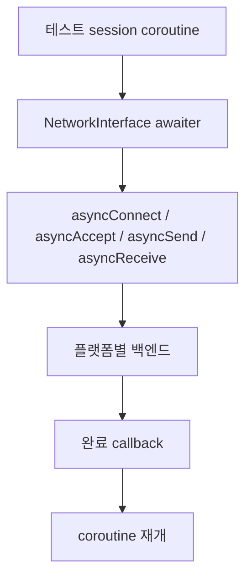
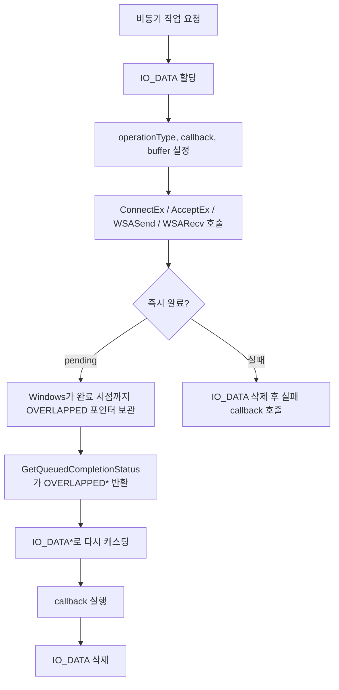
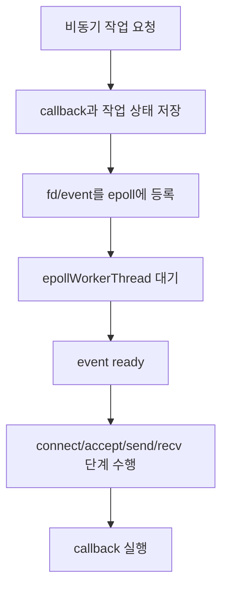

# 네트워크 백엔드

`NetworkInterface`는 플랫폼별 비동기 네트워크 구현을 하나의 callback API와 coroutine awaiter로 감쌉니다.
상위 테스트 로직은 Windows IOCP인지 Linux epoll인지 몰라도 같은 방식으로 `connect`, `accept`, `send`, `receive`를 사용할 수 있습니다.

## 공통 계약

`NetworkInterface.h`의 coroutine helper는 callback 기반 함수를 다음처럼 감쌉니다.

- `connect(ip, port)`는 `asyncConnect`를 감쌉니다.
- `accept()`는 `asyncAccept`를 감쌉니다.
- `send(data)`는 `asyncSend`를 감쌉니다.
- `receive(size)`는 `asyncReceive`를 감쌉니다.

## Windows: IOCP

`WinIOCPNetworkInterface`는 overlapped Winsock 호출과 I/O completion port를 사용합니다.

중요한 점:

- `IO_DATA`는 pending I/O 작업 하나당 하나씩 생성되는 context 객체입니다.
- `OVERLAPPED`가 `IO_DATA`의 첫 번째 멤버라서 완료 시 돌아온 `OVERLAPPED*`를 `IO_DATA*`로 복원할 수 있습니다.
- 비동기 작업을 시작한 함수가 반환된 뒤에도 context가 살아 있어야 하므로 heap 할당이 필요합니다.
- 하나의 멤버변수로 공유하면 send, receive, accept, connect 작업이 겹칠 때 상태와 callback이 덮어써질 수 있습니다.

## Linux: epoll

`LinuxAsyncNetworkInterface`는 non-blocking socket과 epoll worker thread를 사용합니다.

중요한 점:

- `listenFd`는 서버 accept용 소켓입니다.
- `clientFd`는 연결 후 데이터 송수신에 사용하는 소켓입니다.
- `SocketData`는 fd별 작업 상태를 추적합니다.
- Linux 백엔드는 epoll로 readiness를 받은 뒤 worker thread에서 실제 socket 작업을 수행합니다.

## 관련 코드 위치

- Windows 백엔드: `src/myiperf/platform/WinIOCPNetworkInterface.cpp`
- Linux 백엔드: `src/myiperf/platform/LinuxAsyncNetworkInterface.cpp`
- 공통 인터페이스와 awaiter: `include/myiperf/NetworkInterface.h`
