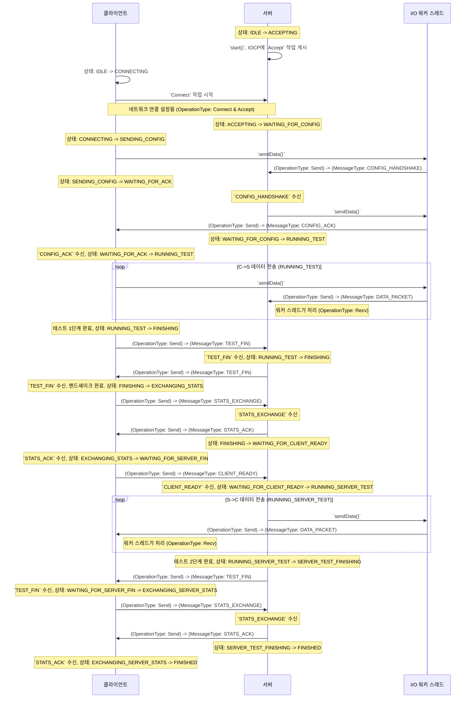

# OperationType, MessageType 및 State 간의 관계

이 문서는 코드베이스에서 네트워크 통신 및 테스트 로직을 정의하는 세 가지 핵심 개념인 `OperationType`, `MessageType` 및 `State` 간의 상호 작용을 설명합니다.

## 1. OperationType

`OperationType`은 네트워크 인터페이스 수준에서 비동기 I/O 작업의 유형을 나타내는 열거형입니다. 이는 시스템의 저수준 동작을 정의하며, 완료된 I/O 요청을 처리하기 위해 IOCP (또는 epoll) 워커 스레드에서 사용됩니다.

-   **Recv**: 연결된 소켓에서 데이터를 수신하는 비동기 작업.
-   **Send**: 연결된 소켓으로 데이터를 보내는 비동기 작업.
-   **Accept**: 서버가 새 클라이언트 연결을 수락하는 비동기 작업.
-   **Connect**: 클라이언트가 서버에 연결을 시도하는 비동기 작업.

I/O 작업이 완료되면 워커 스레드는 해당 `OperationType`을 검색하여 적절한 후속 조치를 결정합니다.

## 2. MessageType

`MessageType`은 애플리케이션 계층 통신 프로토콜의 메시지 유형을 정의합니다. 이는 클라이언트와 서버 간에 어떤 종류의 데이터가 교환되는지를 정의하는 고수준 로직에 해당합니다.

-   **CONFIG_HANDSHAKE**: 테스트 구성을 포함하는 클라이언트에서 서버로의 메시지.
-   **CONFIG_ACK**: 구성을 확인하는 서버에서 클라이언트로의 메시지.
-   **DATA_PACKET**: 성능 테스트 자체에 사용되는 데이터 패킷.
-   **TEST_FIN**: 데이터 전송 단계가 완료되었음을 나타내기 위해 한쪽에서 다른 쪽으로 보내는 신호.
-   **STATS_EXCHANGE**: 테스트 후 성능 통계를 교환하기 위해 보내는 메시지.
-   **STATS_ACK**: 통계 메시지 수신 확인.
-   **CLIENT_READY**: 클라이언트가 테스트의 두 번째 단계(서버-클라이언트)를 시작할 준비가 되었음을 서버에 알리는 신호.

`MessageType`은 각 패킷의 헤더에 포함되어 수신 측이 패킷의 목적을 이해하고 적절한 비즈니스 로직을 실행할 수 있도록 합니다.

## 3. State

`State`는 `TestController`의 현재 단계를 나타냅니다. 이는 테스트 흐름을 관리하는 상태 머신의 핵심 요소입니다.

-   **IDLE**: 테스트가 시작되기 전의 초기 상태.
-   **CONNECTING**: 클라이언트가 서버에 연결을 시도하는 중.
-   **ACCEPTING**: 서버가 클라이언트 연결을 기다리는 중.
-   **SENDING_CONFIG**: 클라이언트가 서버에 구성을 보내는 중.
-   **WAITING_FOR_ACK**: 클라이언트가 서버의 확인을 기다리는 중.
-   **WAITING_FOR_CONFIG**: 서버가 클라이언트의 구성을 기다리는 중.
-   **RUNNING_TEST**: 첫 번째 데이터 전송 단계(클라이언트-서버)가 활성 상태.
-   **FINISHING**: C->S 데이터 전송이 끝났고 완료를 확인하기 위해 핸드셰이크가 진행 중.
-   **EXCHANGING_STATS**: 클라이언트와 서버가 C->S 테스트에 대한 최종 통계를 교환하는 중.
-   **WAITING_FOR_CLIENT_READY**: 서버가 S->C 테스트 준비 신호를 클라이언트로부터 기다리는 중.
-   **RUNNING_SERVER_TEST**: 두 번째 데이터 전송 단계(서버-클라이언트)가 활성 상태.
-   **WAITING_FOR_SERVER_FIN**: 클라이언트가 서버의 데이터 전송이 끝나기를 기다리는 중.
-   **SERVER_TEST_FINISHING**: S->C 데이터 전송이 끝났고 서버가 최종 핸드셰이크를 시작하는 중.
-   **EXCHANGING_SERVER_STATS**: S->C 테스트에 대한 최종 통계가 교환되는 중.
-   **FINISHED**: 테스트가 성공적으로 완료됨.
-   **ERRORED**: 복구할 수 없는 오류가 발생함.

`TestController`는 현재 `State`를 기반으로 다음 작업을 결정하고 수신된 패킷의 `MessageType`에 따라 새 상태로 전환합니다.

## 4. 관계 다이어그램

다음 시퀀스 다이어그램은 2단계 테스트 동안 `OperationType`, `MessageType` 및 `State`가 어떻게 상호 작용하는지를 보여줍니다.

요약하면, `OperationType`은 네트워크 작업 자체를 나타내고, `MessageType`은 송수신되는 데이터의 의미를 나타내며, `State`는 테스트 흐름에서 애플리케이션의 현재 논리적 위치를 나타냅니다. 이 세 가지 요소가 함께 작동하여 전체 시스템의 동작을 정의합니다.