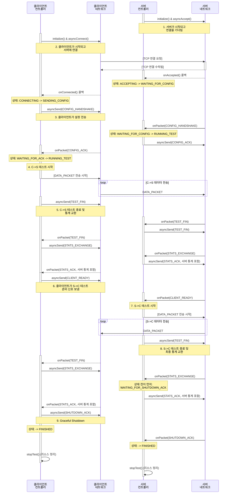

# 전체 상호작용 시퀀스 다이어그램

이 문서는 테스트 시작부터 완료까지 `MyIperf` 클라이언트와 서버 간의 전체 상호 작용 흐름을 상세하게 보여줍니다.

## 핵심 설계 원칙

### Race Condition 방지
모든 상태 전이는 **메시지 전송 전에** 수행됩니다:
- ✅ `transitionTo_nolock(State)` → `asyncSend(packet)`
- ❌ `asyncSend(packet)` → 콜백에서 `transitionTo(State)`

이를 통해 빠른 네트워크 환경에서도 응답 메시지를 올바른 상태에서 처리할 수 있습니다.

### Graceful Shutdown
Phase 2 완료 후 `SHUTDOWN_ACK` 교환으로 양측이 안전하게 종료됩니다.

## 1. 다이어그램

## 2. 전체 순서 설명

1.  **서버 준비**: 서버 `TestController`는 `NetworkInterface`를 초기화하고 `asyncAccept`를 호출하여 비동기적으로 클라이언트 연결을 기다립니다.

2.  **클라이언트 연결**: 클라이언트 `TestController`는 `NetworkInterface`를 초기화하고 `asyncConnect`를 호출하여 서버에 연결합니다. TCP 연결이 설정됩니다.

3.  **설정 핸드셰이크**: 서버는 연결을 감지합니다(`onAccepted`). 클라이언트는 연결 성공 시(`onConnected`) `CONFIG_HANDSHAKE` 메시지를 보냅니다. 서버는 이를 수신하고 처리한 후 `CONFIG_ACK`로 응답합니다.

4.  **1단계: 클라이언트-서버 테스트**: `CONFIG_ACK`를 수신하면 클라이언트는 `RUNNING_TEST` 상태로 들어가 설정된 시간 동안 서버에 `DATA_PACKET`을 보내기 시작합니다.

5.  **C->S 통계 교환**: 클라이언트가 전송을 마치면 `TEST_FIN` 핸드셰이크를 시작합니다. 양측이 `TEST_FIN`을 보내고 받으면 클라이언트는 `STATS_EXCHANGE` 메시지를 보냅니다. 서버는 해당 단계에 대한 자체 통계를 포함하는 `STATS_ACK`로 응답합니다.

6.  **2단계 준비**: 첫 번째 통계 교환이 완료된 후 클라이언트는 서버-클라이언트 테스트 준비가 되었음을 알리기 위해 서버에 `CLIENT_READY` 메시지를 보냅니다.

7.  **2단계: 서버-클라이언트 테스트**: `CLIENT_READY`를 수신하면 서버는 `RUNNING_SERVER_TEST` 상태로 들어가 클라이언트에 `DATA_PACKET`을 보내기 시작합니다.

8.  **S->C 최종 통계 교환**: 서버가 전송을 마치면 최종 `TEST_FIN` 핸드셰이크를 시작합니다. 클라이언트는 `TEST_FIN`을 수신하면 수신기 통계를 `STATS_EXCHANGE` 메시지로 보냅니다. 
    - 서버는 **상태를 먼저 `WAITING_FOR_SHUTDOWN_ACK`로 전이**한 후 발신자 통계를 포함하는 최종 `STATS_ACK`를 보냅니다.
    - 이 패턴은 빠른 네트워크 환경에서 race condition을 방지합니다.

9.  **Graceful Shutdown**: 클라이언트는 서버 통계를 받은 후 `SHUTDOWN_ACK`를 전송하고 `FINISHED` 상태로 전환됩니다. 서버는 `SHUTDOWN_ACK`를 수신하면 `FINISHED`로 전환됩니다.

10. **종료**: 두 단계가 모두 완료되고 graceful shutdown이 완료되면 두 컨트롤러 모두 `FINISHED` 상태에 있습니다. 그런 다음 `stopTest()`를 호출하여 모든 리소스(소켓, 스레드 등)를 정리하고 애플리케이션이 종료됩니다.

## 3. 중요한 구현 세부사항

### asyncSend 패턴의 일관성
코드베이스 전체에서 다음 6개 위치에서 상태 전이를 메시지 전송 전에 수행합니다:

1. **클라이언트 CONFIG 전송** (Line ~301): `WAITING_FOR_ACK` 전이 후 `CONFIG_HANDSHAKE` 전송
2. **서버 CONFIG_ACK 전송** (Line ~510): `RUNNING_TEST` 전이 후 `CONFIG_ACK` 전송
3. **서버 Phase 1 STATS_ACK 전송** (Line ~585): `WAITING_FOR_CLIENT_READY` 전이 후 전송
4. **클라이언트 CLIENT_READY 전송** (Line ~734): `WAITING_FOR_SERVER_FIN` 전이 후 전송
5. **서버 Phase 2 STATS_ACK 전송** (Line ~629): `WAITING_FOR_SHUTDOWN_ACK` 전이 후 전송
6. **클라이언트 Phase 2 STATS_EXCHANGE 전송** (Line ~684): `EXCHANGING_SERVER_STATS` 전이 후 전송

이 일관된 패턴은 다음을 보장합니다:
- 네트워크 속도와 무관한 안정적인 동작
- Race condition 완전 제거
- 예측 가능한 상태 머신 동작
