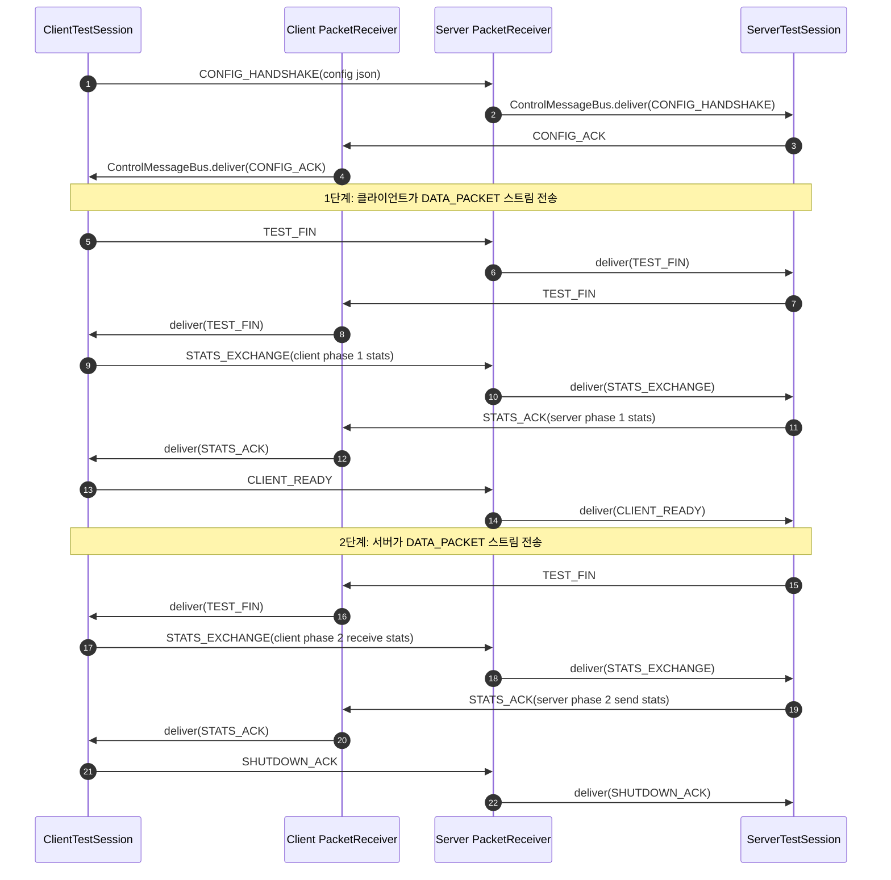
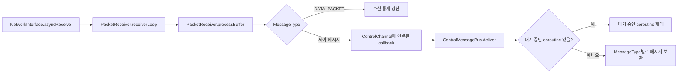

# 제어 메시지 시퀀스

이 문서는 프로토콜 제어 메시지 흐름만 추적합니다.
실제 부하 측정용 데이터 패킷은 제어 메시지 사이에서 `PacketGenerator`와 `PacketReceiver`를 통해 흐릅니다.

```mermaid
sequenceDiagram
    autonumber
    participant Client as ClientTestSession
    participant ClientRx as Client PacketReceiver
    participant ServerRx as Server PacketReceiver
    participant Server as ServerTestSession

    Client->>ServerRx: CONFIG_HANDSHAKE(config json)
    ServerRx->>Server: ControlMessageBus.deliver(CONFIG_HANDSHAKE)
    Server->>ClientRx: CONFIG_ACK
    ClientRx->>Client: ControlMessageBus.deliver(CONFIG_ACK)

    Note over Client,Server: 1단계: 클라이언트가 DATA_PACKET 스트림 전송

    Client->>ServerRx: TEST_FIN
    ServerRx->>Server: deliver(TEST_FIN)
    Server->>ClientRx: TEST_FIN
    ClientRx->>Client: deliver(TEST_FIN)
    Client->>ServerRx: STATS_EXCHANGE(client phase 1 stats)
    ServerRx->>Server: deliver(STATS_EXCHANGE)
    Server->>ClientRx: STATS_ACK(server phase 1 stats)
    ClientRx->>Client: deliver(STATS_ACK)

    Client->>ServerRx: CLIENT_READY
    ServerRx->>Server: deliver(CLIENT_READY)

    Note over Client,Server: 2단계: 서버가 DATA_PACKET 스트림 전송

    Server->>ClientRx: TEST_FIN
    ClientRx->>Client: deliver(TEST_FIN)
    Client->>ServerRx: STATS_EXCHANGE(client phase 2 receive stats)
    ServerRx->>Server: deliver(STATS_EXCHANGE)
    Server->>ClientRx: STATS_ACK(server phase 2 send stats)
    ClientRx->>Client: deliver(STATS_ACK)
    Client->>ServerRx: SHUTDOWN_ACK
    ServerRx->>Server: deliver(SHUTDOWN_ACK)
```

## 메시지 역할

| MessageType | 역할 |
| --- | --- |
| `CONFIG_HANDSHAKE` | 클라이언트가 서버에 테스트 설정을 전달합니다. |
| `CONFIG_ACK` | 서버가 설정 수신과 적용을 확인합니다. |
| `DATA_PACKET` | 처리량 측정용 데이터입니다. `PacketReceiver` 통계에 반영됩니다. |
| `TEST_FIN` | 현재 데이터 전송 단계가 끝났음을 알립니다. |
| `STATS_EXCHANGE` | 로컬 통계를 JSON payload로 전달합니다. |
| `STATS_ACK` | 상대 통계를 돌려주고 통계 교환을 확인합니다. |
| `CLIENT_READY` | 클라이언트가 2단계 수신 준비를 마쳤음을 서버에 알립니다. |
| `SHUTDOWN_ACK` | 클라이언트가 최종 종료를 확인합니다. |

## 수신 패킷 처리 경로

```mermaid
flowchart LR
    A[NetworkInterface.asyncReceive] --> B[PacketReceiver.receiverLoop]
    B --> C[PacketReceiver.processBuffer]
    C --> D{MessageType}
    D -->|DATA_PACKET| E[수신 통계 갱신]
    D -->|제어 메시지| F[ControlChannel에 연결된 callback]
    F --> G[ControlMessageBus.deliver]
    G --> H{대기 중인 coroutine 있음?}
    H -->|예| I[대기 중인 coroutine 재개]
    H -->|아니오| J[MessageType별로 메시지 보관]
```
