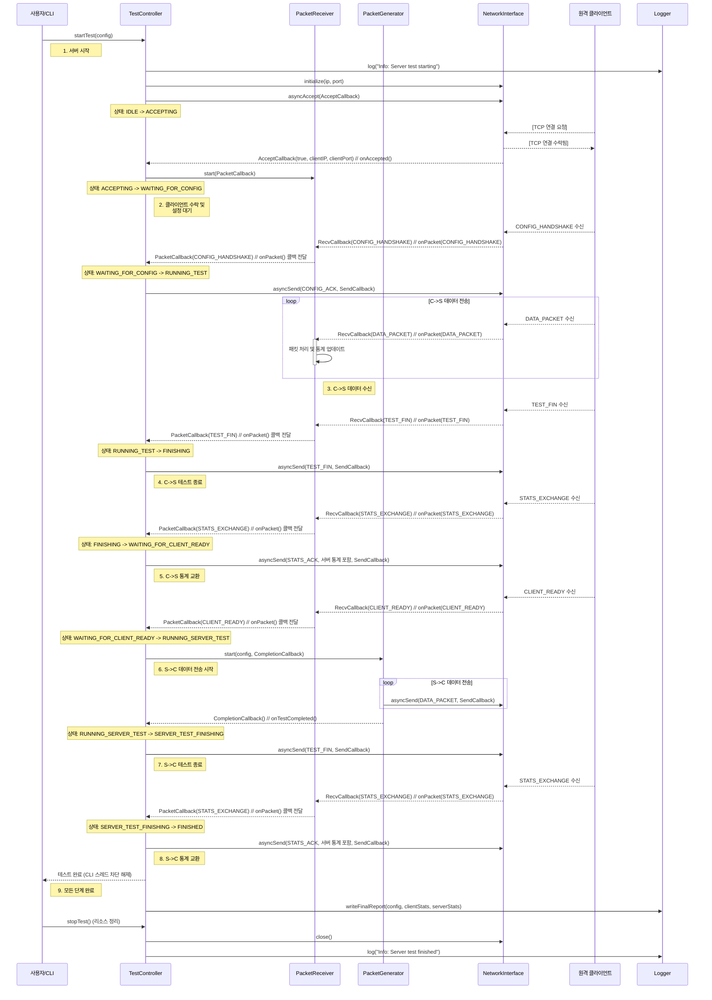

# 서버 측 시퀀스 다이어그램

이 문서는 `MyIperf` 서버의 내부 구성 요소 간의 상호 작용 순서를 시작부터 테스트 완료까지 보여줍니다.

## 핵심 설계 원칙

### 상태 전이 타이밍
모든 `asyncSend` 호출 **전에** 상태 전이를 수행하여 race condition을 방지합니다:
- ✅ `transitionTo_nolock(NewState)` → `asyncSend(packet)`
- ❌ `asyncSend(packet)` → 콜백에서 `transitionTo(NewState)`

### Graceful Shutdown
Phase 2 완료 후 `WAITING_FOR_SHUTDOWN_ACK` 상태에서 클라이언트의 최종 확인을 대기합니다.

### PacketGenerator 재시작
Phase 2에서 `PacketGenerator::start()` 호출 시:
- 이전 스레드를 완전히 정리 (`joinable()` 체크 및 `join()`)
- `running` 플래그 강제 리셋
- 새 스레드 생성 및 성공 로깅

## 1. 다이어그램

## 2. 순서 설명

1.  **서버 시작**: 사용자가 서버 모드에서 프로그램을 실행하면 `TestController.startTest()`가 호출됩니다.

2.  **클라이언트 수락 및 설정 대기**: `TestController`는 `NetworkInterface`를 초기화하고, 수신 소켓을 설정한 후 `asyncAccept`를 호출합니다. 클라이언트가 연결되면(`onAccepted` 콜백), 컨트롤러는 `PacketReceiver`를 시작하고 클라이언트의 설정을 기다립니다(`WAITING_FOR_CONFIG` 상태).

3.  **1단계: 클라이언트-서버 데이터 전송**:
    *   `PacketReceiver`가 `CONFIG_HANDSHAKE`를 받아 `TestController`에 전달합니다.
    *   컨트롤러는 `CONFIG_ACK`를 다시 보내고 `RUNNING_TEST`로 전환합니다.
    *   `PacketReceiver`는 클라이언트로부터 계속해서 `DATA_PACKET`을 수신하여 처리하고 내부 통계를 업데이트합니다.

4.  **C->S 테스트 종료**: 서버는 클라이언트로부터 첫 번째 데이터 전송 단계의 종료를 알리는 `TEST_FIN`을 수신합니다. 컨트롤러는 핸드셰이크를 완료하기 위해 자체 `TEST_FIN`을 보냅니다.

5.  **C->S 통계 교환**: 서버는 클라이언트의 `STATS_EXCHANGE` 메시지를 수신합니다. 이 통계를 처리하고 자체 수신기 통계를 `STATS_ACK` 메시지로 다시 보낸 다음 `WAITING_FOR_CLIENT_READY`로 전환합니다.

6.  **S->C 데이터 전송 시작**: 서버는 `CLIENT_READY` 신호를 수신합니다. 그런 다음 `PacketGenerator`를 시작하여 클라이언트로 데이터 전송을 시작합니다(`RUNNING_SERVER_TEST` 상태).

7.  **S->C 테스트 종료**: `PacketGenerator`가 전송 기간을 완료하면 `TestController`에 알립니다(`onTestCompleted` 콜백). 컨트롤러는 클라이언트에 `TEST_FIN`을 보냅니다.

8.  **S->C 통계 교환**: 서버는 클라이언트로부터 최종 `STATS_EXCHANGE`를 수신합니다(2단계에 대한 클라이언트의 수신기 통계 포함). 서버는 최종 `STATS_ACK`(자체 발신자 통계 포함)를 보내고 `FINISHED`로 전환합니다.

9.  **최종 종료**: `TestController`는 주 CLI 스레드의 차단을 해제합니다. `stopTest()`가 호출되어 모든 네트워크 리소스를 정리하고 프로그램이 종료됩니다.
