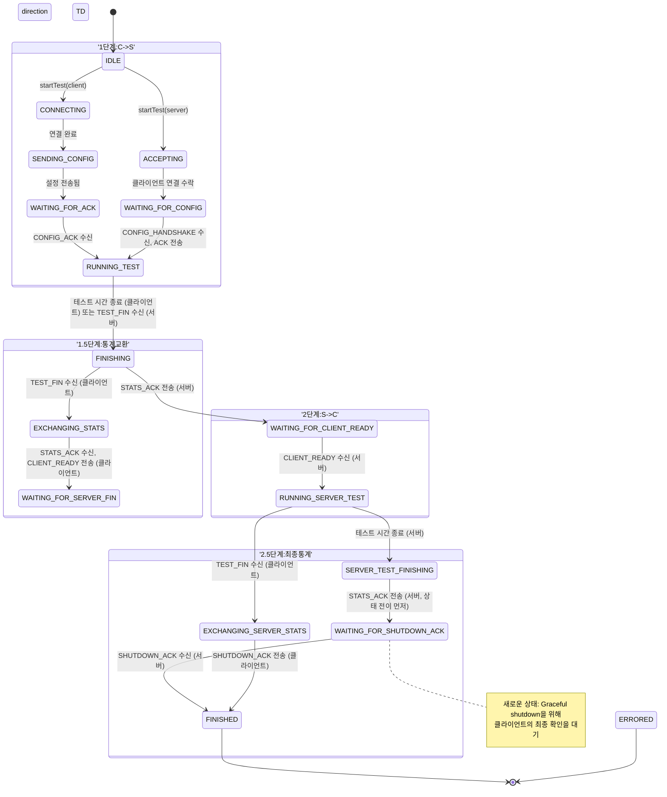

# MyIperf 상태 머신 다이어그램

이 문서는 애플리케이션 생명주기 관리의 핵심인 `TestController`의 상태 머신을 상세히 설명합니다.

## 핵심 설계 원칙

### 1. 상태 전이 타이밍 (Race Condition 방지)
모든 `asyncSend` 호출 **전에** 상태 전이를 수행합니다:
```cpp
// 올바른 패턴
transitionTo_nolock(NewState);  // 상태 전이 먼저
networkInterface->asyncSend(packet, callback);  // 메시지 전송 후
```

**이유**: 네트워크가 빠른 경우 응답이 `asyncSend` 콜백 실행 **전에** 도착할 수 있습니다. 상태를 먼저 전이하면 응답을 올바른 상태에서 처리할 수 있습니다.

### 2. Graceful Shutdown
Phase 2 완료 후 클라이언트가 `SHUTDOWN_ACK`를 전송하여 서버가 안전하게 종료할 수 있도록 보장합니다.

### 3. 스레드 안전성
- `transitionTo()`: Mutex를 획득하여 스레드 안전 보장
- `transitionTo_nolock()`: 이미 mutex를 보유한 컨텍스트에서 사용 (데드락 방지)

## 1. 상태 머신 다이어그램 (Mermaid)

이 다이어그램은 `TestController`가 네트워크 이벤트(예: 패킷 수신)나 내부 트리거(예: 타이머 만료)에 응답하여 여러 상태 간에 어떻게 전환되는지를 보여줍니다.



## 2. 상태 설명

이 다이어그램은 `TestController`의 생명주기를 보여줍니다. 프로세스는 두 개의 주요 테스트 단계로 나뉘며, 각 단계 후에 통계가 교환됩니다.

*   **공통 상태:**
    *   `IDLE`: 초기 상태. 컨트롤러가 테스트 시작을 기다립니다.
    *   `ERRORED`: 치명적인 오류가 발생했습니다. 테스트가 종료되고 리소스가 정리됩니다.
    *   `FINISHED`: 모든 테스트 단계와 통계 교환이 성공적으로 완료되었습니다.

*   **1단계: 클라이언트 -> 서버 테스트**
    *   `CONNECTING` (클라이언트): `startTest()`에 의해 시작됩니다. 클라이언트가 서버에 연결을 시도합니다. 성공 시 `SENDING_CONFIG`로 전환됩니다.
    *   `ACCEPTING` (서버): `startTest()`에 의해 시작됩니다. 서버가 들어오는 클라이언트 연결을 기다립니다. 성공 시 `WAITING_FOR_CONFIG`로 전환됩니다.
    *   `SENDING_CONFIG` (클라이언트): 클라이언트가 테스트 매개변수가 포함된 `CONFIG_HANDSHAKE` 패킷을 서버로 보냅니다.
    *   `WAITING_FOR_CONFIG` (서버): 서버가 `CONFIG_HANDSHAKE` 패킷 수신을 기다립니다.
    *   `WAITING_FOR_ACK` (클라이언트): 클라이언트가 테스트 매개변수를 확인하기 위해 서버의 `CONFIG_ACK`를 기다립니다.
    *   `RUNNING_TEST`: 주 데이터 전송 단계입니다.
        *   **클라이언트**: 설정된 시간 동안 데이터 패킷을 보냅니다. 타이머가 만료되면 `FINISHING`으로 전환됩니다.
        *   **서버**: 데이터 패킷을 수신합니다. `TEST_FIN` 메시지를 받으면 `FINISHING`으로 전환됩니다.

*   **1.5단계: C->S 통계 교환**
    *   `FINISHING`: 간단한 핸드셰이크 상태입니다. 클라이언트는 서버에 `TEST_FIN`을 보내고, 서버는 이를 수신합니다. 클라이언트는 통계를 교환하기 전에 서버로부터 `TEST_FIN`을 다시 받을 때까지 기다립니다.
    *   `EXCHANGING_STATS` (클라이언트): 클라이언트가 자신의 통계(`STATS_EXCHANGE` 패킷)를 보내고 서버의 `STATS_ACK`를 기다립니다.
    *   `WAITING_FOR_CLIENT_READY` (서버): `STATS_ACK`를 보낸 후, 서버는 두 번째 테스트 단계를 시작하기 위해 `CLIENT_READY` 신호를 기다립니다.

*   **2단계: 서버 -> 클라이언트 테스트**
    *   `WAITING_FOR_SERVER_FIN` (클라이언트): `CLIENT_READY`를 보낸 후, 클라이언트는 서버로부터 데이터 수신을 준비합니다.
    *   `RUNNING_SERVER_TEST`: 두 번째 데이터 전송 단계입니다.
        *   **서버**: `CLIENT_READY`를 수신하면 설정된 시간 동안 데이터 패킷을 보내기 시작합니다. 타이머가 만료되면 `SERVER_TEST_FINISHING`으로 전환됩니다.
        *   **클라이언트**: 서버로부터 데이터 패킷을 수신합니다.

*   **2.5단계: S->C 최종 통계 교환 및 Graceful Shutdown**
    *   `SERVER_TEST_FINISHING`: 서버가 `TEST_FIN` 메시지를 보내고, 클라이언트가 두 번째 단계의 통계를 보내기를 기다립니다.
    *   `EXCHANGING_SERVER_STATS` (클라이언트): 최종 `TEST_FIN`을 수신하면, 클라이언트는 2단계 통계를 보내고 최종 `STATS_ACK`를 기다립니다.
    *   `WAITING_FOR_SHUTDOWN_ACK` (서버): **상태 전이를 먼저** 수행한 후 `STATS_ACK`를 전송하고, 클라이언트의 최종 `SHUTDOWN_ACK`를 기다립니다.
    *   클라이언트는 서버 통계를 받은 후 `SHUTDOWN_ACK`를 전송하고 `FINISHED`로 전환됩니다.
    *   서버는 `SHUTDOWN_ACK`를 수신하면 `FINISHED`로 전환됩니다.
    
    **중요**: 모든 메시지 전송 전에 상태 전이를 먼저 수행하여 race condition을 방지합니다.