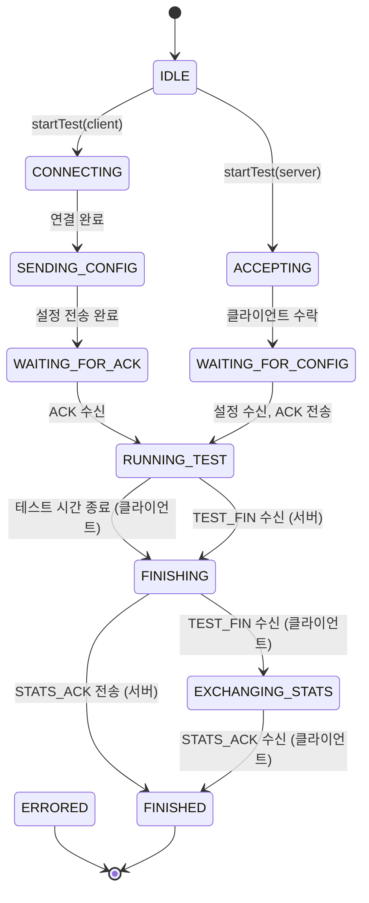

# MyIperf (IPEFTC)

iperf와 유사한 C++로 제작된 네트워크 성능 테스트 도구입니다. 클라이언트-서버 모델을 사용하여 네트워크 처리량을 측정합니다. 이 프로젝트는 CMake를 사용하여 빌드되었으며, Windows (IOCP)와 Linux (epoll)를 모두 지원합니다.

## 빌드 방법

1.  **빌드 디렉터리 생성:**
    ```shell
    cd D:\01_SW2_Project\MyIperf
    mkdir build
    cd build
    ```

2.  **CMake로 빌드 파일 생성:**
    ```shell
    cmake ..
    ```

3.  **프로젝트 빌드:**
    *   생성된 `.sln` 파일을 Visual Studio에서 열고 컴파일할 수 있습니다.
    *   또는, 커맨드 라인에서 빌드할 수 있습니다 (예: 릴리스 모드):
        ```shell
        cmake --build . --config Release
        ```

## 실행 방법

### 서버 모드

서버 모드에서 실행 파일을 실행하고, 리슨할 IP와 포트를 지정합니다.

```shell
# 디버그 빌드
.\build\Debug\IPEFTC.exe --mode server --target 0.0.0.0 --port 5201 --save-logs true

# 릴리스 빌드
.\build\Release\IPEFTC.exe --mode server --target 0.0.0.0 --port 5201 --save-logs true
```

### 클라이언트 모드

클라이언트 모드에서 실행 파일을 실행하고, 서버의 IP와 포트 및 테스트 매개변수를 지정합니다.

```shell
# 디버그 빌드
.\build\Debug\IPEFTC.exe --mode client --target 127.0.0.1 --port 5201 --packet-size 8192 --num-packets 100 --save-logs true

# 릴리스 빌드
.\build\Release\IPEFTC.exe --mode client --target 127.0.0.1 --port 5201 --packet-size 8192 --num-packets 100 --save-logs true
```

---

## 프로토콜 흐름 및 상태 머신

이 애플리케이션은 테스트 생명주기를 관리하기 위해 엄격한 상태 머신을 따릅니다. 주요 상태와 전환은 아래 다이어그램에 나와 있습니다. 최근 최종 통계를 교환하기 전에 클라이언트와 서버 모두 데이터 전송 단계를 완료했는지 확인하기 위해 `TEST_FIN` 핸드셰이크가 추가되었습니다.


---
## CMake 빌드 정리

CMake 빌드 결과물을 정리하려면 `build` 디렉터리를 삭제하거나 그 안의 캐시를 제거할 수 있습니다:
```shell
cd D:\01_SW2_Project\MyIperf\build
del CMakeCache.txt
# 생성기에 따라 더 많은 파일을 삭제해야 할 수도 있습니다
```