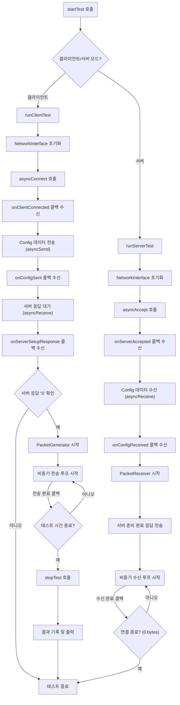

```mermaid
graph TD
    StartTest("startTest 호출") --> CheckMode{"클라이언트/서버 모드?"};
    
    %% Client Path
    CheckMode -- "클라이언트" --> ClientRunTest["runClientTest"];
    ClientRunTest --> ClientInitNI["NetworkInterface 초기화"];
    ClientInitNI --> ClientAsyncConnect["asyncConnect 호출"];
    ClientAsyncConnect --> ClientOnConnected["onClientConnected 콜백 수신"];
    ClientOnConnected --> ClientSendConfig["Config 데이터 전송 (asyncSend)"];
    ClientSendConfig --> ClientOnConfigSent["onConfigSent 콜백 수신"];
    ClientOnConfigSent --> ClientAwaitResponse["서버 응답 대기 (asyncReceive)"];
    ClientAwaitResponse --> ClientOnResponse["onServerSetupResponse 콜백 수신"];
    ClientOnResponse --> ClientCheckResponse{"서버 응답 'S' 확인"};
    ClientCheckResponse -- "예" --> ClientStartGenerator["PacketGenerator 시작"];
    ClientCheckResponse -- "아니오" --> EndTest["테스트 종료"];
    
    ClientStartGenerator --> ClientSendLoop("비동기 전송 루프 시작");
    ClientSendLoop -- "전송 완료 콜백" --> ClientCheckDuration{"테스트 시간 종료?"};
    ClientCheckDuration -- "아니오" --> ClientSendLoop;
    ClientCheckDuration -- "예" --> ClientStopTest["stopTest 호출"];
    ClientStopTest --> ClientLogResults["결과 기록 및 출력"];
    ClientLogResults --> EndTest;

    %% Server Path
    CheckMode -- "서버" --> ServerRunTest["runServerTest"];
    ServerRunTest --> ServerInitNI["NetworkInterface 초기화"];
    ServerInitNI --> ServerAsyncAccept["asyncAccept 호출"];
    ServerAsyncAccept --> ServerOnAccepted["onServerAccepted 콜백 수신"];
    ServerOnAccepted --> ServerReceiveConfig["Config 데이터 수신 (asyncReceive)"];
    ServerReceiveConfig --> ServerOnConfigReceived["onConfigReceived 콜백 수신"];
    ServerOnConfigReceived --> ServerStartReceiver["PacketReceiver 시작"];
    ServerStartReceiver --> ServerSendReadyResponse["서버 준비 완료 응답 전송"];
    ServerSendReadyResponse --> ServerReceiveLoop("비동기 수신 루프 시작");
    ServerReceiveLoop -- "수신 완료 콜백" --> ServerCheckConnectionClosed{"연결 종료? (0 bytes)"};
    ServerCheckConnectionClosed -- "아니오" --> ServerReceiveLoop;
    ServerCheckConnectionClosed -- "예" --> EndTest;
```