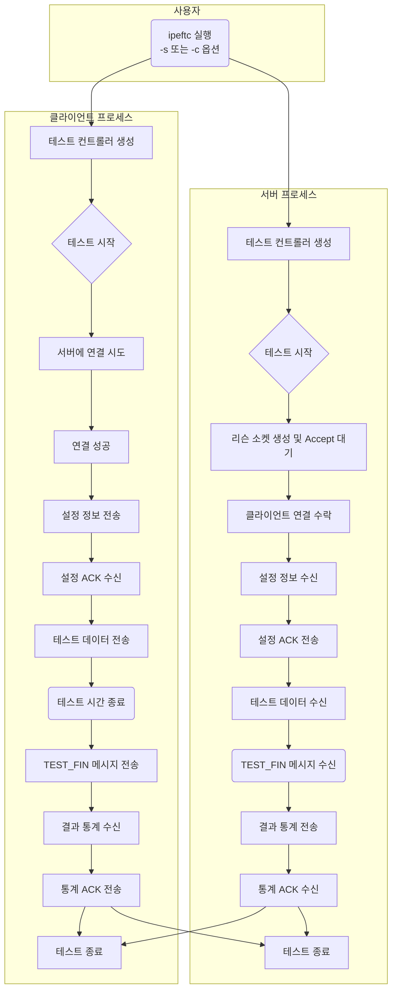
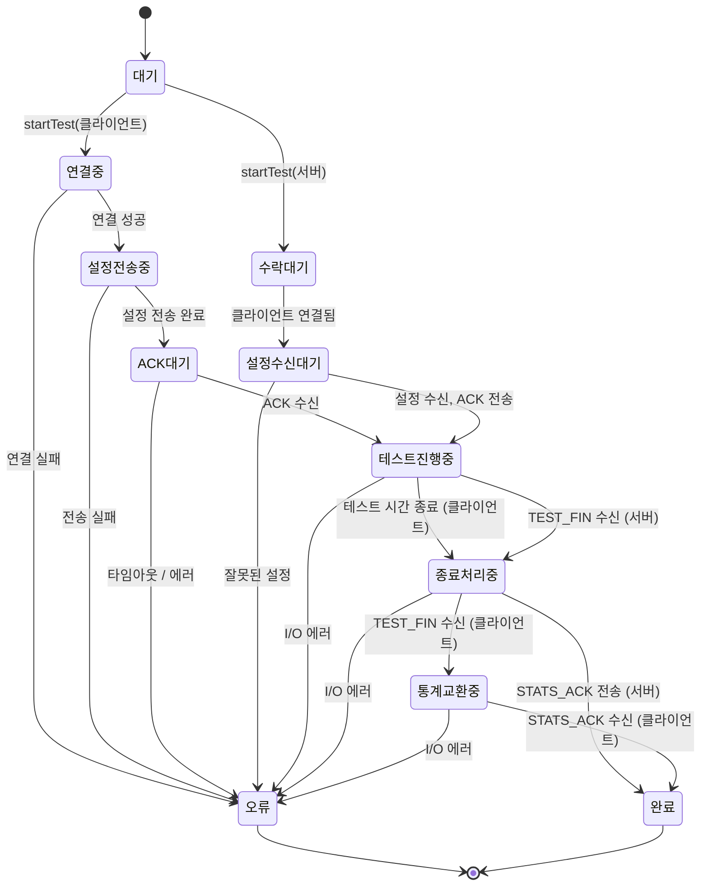

# MyIperf 동작 흐름 (Activity Diagram & State Diagram)

이 문서는 `MyIperf` 프로그램이 테스트를 수행하는 전체적인 과정과 내부 상태 변화를 설명합니다.

## 1. 전체 동작 흐름 (Activity Diagram)

아래 다이어그램은 사용자가 `MyIperf`를 실행하는 시점부터 테스트가 완료되기까지 서버와 클라이언트에서 일어나는 일련의 활동들을 순서대로 보여줍니다.

### 설명

1.  **실행**: 사용자가 서버(`-s`) 또는 클라이언트(`-c`) 옵션으로 프로그램을 실행합니다.
2.  **테스트 준비**:
    *   **서버**: 클라이언트의 연결을 기다립니다 (`Accept`).
    *   **클라이언트**: 서버에 연결을 시도합니다 (`Connect`).
3.  **설정 교환**:
    *   클라이언트가 연결에 성공하면, 테스트 설정을 서버에 전송합니다.
    *   서버는 설정을 받은 후 클라이언트에게 확인(ACK) 응답을 보냅니다.
4.  **테스트 진행**:
    *   클라이언트는 설정된 시간 동안 서버로 테스트 데이터 패킷을 전송합니다.
    *   서버는 해당 패킷들을 수신합니다.
5.  **테스트 종료 및 결과 교환**:
    *   **클라이언트**: 테스트 시간이 만료되면 `TEST_FIN` 메시지를 보내 테스트 종료를 알립니다.
    *   **서버**: `TEST_FIN`을 받으면, 수신한 데이터 통계를 클라이언트에 전송합니다.
    *   **클라이언트**: 서버로부터 통계를 받은 후, 최종 확인(ACK)을 보냅니다.
6.  **완료**: 양측 모두 연결을 종료하고 프로그램을 마칩니다.

## 2. TestController 상태 변화 (State Diagram)

아래 다이어그램은 `TestController` 내부의 상태가 특정 이벤트에 따라 어떻게 변화하는지를 보여주는 상태 머신 다이어그램입니다.

### 상태 설명

*   **대기 (IDLE)**: 프로그램이 시작되고 명령을 기다리는 초기 상태입니다.
*   **연결중 (CONNECTING)**: 클라이언트가 서버에 연결을 시도하는 상태입니다.
*   **수락대기 (ACCEPTING)**: 서버가 클라이언트의 연결을 기다리는 상태입니다.
*   **설정전송중 (SENDING_CONFIG)**: 클라이언트가 서버로 테스트 설정을 보내는 상태입니다.
*   **ACK대기 (WAITING_FOR_ACK)**: 클라이언트가 서버의 설정 확인(ACK)을 기다리는 상태입니다.
*   **설정수신대기 (WAITING_FOR_CONFIG)**: 서버가 클라이언트로부터 설정을 기다리는 상태입니다.
*   **테스트진행중 (RUNNING_TEST)**: 실제 데이터 패킷을 주고받는 테스트가 진행되는 상태입니다.
*   **종료처리중 (FINISHING)**: 테스트 시간이 만료되거나 종료 메시지를 받아 마무리를 시작하는 상태입니다.
*   **통계교환중 (EXCHANGING_STATS)**: 클라이언트와 서버가 최종 테스트 통계를 교환하는 상태입니다.
*   **완료 (FINISHED)**: 모든 과정이 정상적으로 끝나고 테스트가 종료된 상태입니다.
*   **오류 (ERRORED)**: 과정 중 문제가 발생하여 테스트가 비정상적으로 종료된 상태입니다.
