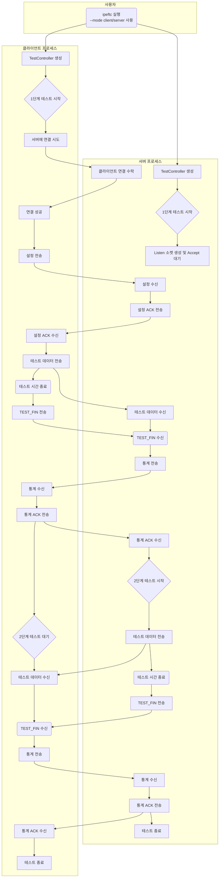
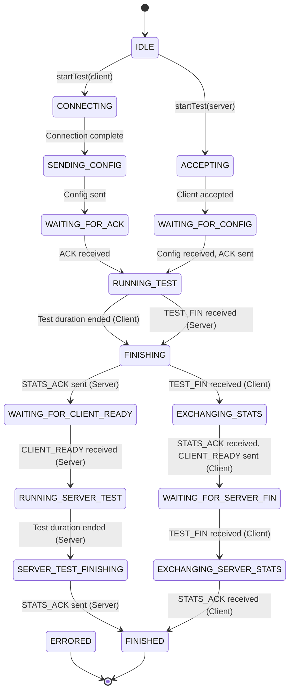

# MyIperf 활동 및 상태 다이어그램

이 문서는 테스트 중 `MyIperf` 프로그램의 전체 프로세스와 내부 상태 전환을 설명합니다.

## 1. 전체 워크플로 (활동 다이어그램)

아래 다이어그램은 사용자가 `MyIperf`를 실행하는 순간부터 테스트가 완료될 때까지 서버와 클라이언트의 활동 순서를 보여줍니다.

### 설명

1.  **실행**: 사용자가 서버 (`--mode server`) 또는 클라이언트 (`--mode client`) 옵션으로 프로그램을 실행합니다.
2.  **테스트 준비**:
    *   **서버**: 클라이언트 연결을 기다립니다 (`Accept`).
    *   **클라이언트**: 서버에 연결을 시도합니다 (`Connect`).
3.  **설정 교환**:
    *   연결되면 클라이언트는 테스트 설정을 서버에 보냅니다.
    *   서버는 설정을 수신하고 확인(ACK)을 다시 보냅니다.
4.  **1단계 테스트: 클라이언트 -> 서버**:
    *   클라이언트는 설정된 시간 동안 서버에 테스트 데이터 패킷을 보냅니다.
    *   서버는 이 패킷들을 수신합니다.
    *   시간이 만료되면 클라이언트는 `TEST_FIN`을 보내고, 서버는 통계를 보내고, 클라이언트는 ACK로 응답하여 1단계를 마칩니다.
5.  **2단계 테스트: 서버 -> 클라이언트**:
    *   1단계가 끝나면 서버가 클라이언트로 테스트 데이터 패킷을 보내기 시작합니다.
    *   클라이언트는 이 패킷들을 수신합니다.
    *   서버의 테스트 시간이 만료되면 `TEST_FIN`을 보내고, 클라이언트는 통계를 보내고, 서버는 ACK로 응답하여 2단계를 마칩니다.
6.  **완료**: 모든 단계가 끝나면 양측은 연결을 닫고 프로그램을 종료합니다.

## 2. TestController 상태 전환 (상태 다이어그램)

아래 다이어그램은 특정 이벤트에 대한 응답으로 `TestController`의 내부 상태가 어떻게 변하는지를 보여주는 상태 머신 다이어그램입니다.

### 상태 설명

*   **IDLE**: 명령을 기다리는 초기 상태.
*   **CONNECTING**: 클라이언트가 서버에 연결을 시도하는 중.
*   **ACCEPTING**: 서버가 클라이언트 연결을 기다리는 중.
*   **SENDING_CONFIG**: 클라이언트가 서버에 테스트 설정을 보내는 중.
*   **WAITING_FOR_ACK**: 클라이언트가 서버의 설정 확인을 기다리는 중.
*   **WAITING_FOR_CONFIG**: 서버가 클라이언트의 설정을 기다리는 중.
*   **RUNNING_TEST**: 기본 데이터 전송 단계(클라이언트->서버)가 진행 중.
*   **FINISHING**: C->S 데이터 전송이 종료되었고, 양측이 확인을 위해 핸드셰이크를 수행하는 중.
*   **EXCHANGING_STATS**: 클라이언트와 서버가 C->S 테스트의 최종 통계를 교환하는 중.
*   **WAITING_FOR_CLIENT_READY**: 서버가 S->C 테스트 준비가 되었다는 클라이언트의 신호를 기다리는 중.
*   **RUNNING_SERVER_TEST**: 두 번째 데이터 전송 단계(서버->클라이언트)가 진행 중.
*   **WAITING_FOR_SERVER_FIN**: 클라이언트가 서버의 데이터 전송이 끝나기를 기다리는 중.
*   **SERVER_TEST_FINISHING**: S->C 데이터 전송이 종료되었고, 서버가 최종 핸드셰이크를 시작하는 중.
*   **EXCHANGING_SERVER_STATS**: S->C 테스트의 최종 통계가 교환되는 중.
*   **FINISHED**: 모든 프로세스가 성공적으로 완료됨.
*   **ERRORED**: 오류가 발생하여 테스트가 비정상적으로 종료됨.
