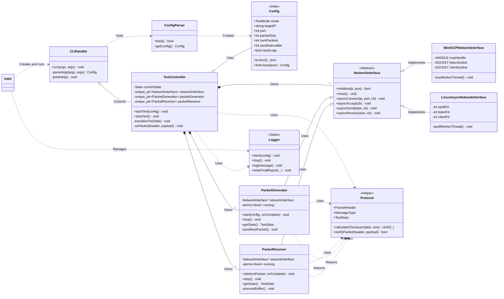

# 클래스 다이어그램

이 문서는 `MyIperf` 프로젝트의 주요 클래스 구조와 관계를 설명합니다.

## 1. 다이어그램

## 2. 주요 클래스 설명

*   **`main`**: 애플리케이션 진입점. `Logger` 및 `CLIHandler`와 같은 고수준 구성 요소를 초기화하고 조율합니다.
*   **`CLIHandler`**: 명령줄 인수를 구문 분석하고 `TestController`를 제어하여 테스트를 시작하는 역할을 합니다.
*   **`ConfigParser`**: JSON 설정 파일을 읽고 구문 분석하여 `Config` 객체를 생성합니다.
*   **`Config`**: 모드, 대상 IP, 포트 및 패킷 크기와 같은 테스트의 모든 설정 정보를 저장하는 데이터 클래스입니다.
*   **`TestController`**: 전체 테스트 수명 주기를 관리하는 핵심 클래스. 상태 머신을 사용하여 테스트 흐름을 제어하고 `NetworkInterface`, `PacketGenerator` 및 `PacketReceiver`의 동작을 조정합니다.
*   **`NetworkInterface`**: 네트워크 통신을 위한 추상 인터페이스. 플랫폼별 구현이 있습니다.
*   **`WinIOCPNetworkInterface`**: 고성능 비동기 I/O를 위해 Windows I/O 완료 포트(IOCP)를 사용하여 `NetworkInterface`를 구현합니다.
*   **`LinuxAsyncNetworkInterface`**: 고성능 비동기 I/O를 위해 Linux epoll을 사용하여 `NetworkInterface`를 구현합니다.
*   **`PacketGenerator`**: 클라이언트 모드에서 설정에 따라 테스트 패킷을 생성하고 `NetworkInterface`를 통해 전송합니다.
*   **`PacketReceiver`**: 네트워크에서 데이터를 수신하고 완전한 패킷으로 조립하며 유효성을 검사하고 통계를 기록합니다.
*   **`Protocol`**: `PacketHeader`, `MessageType` 및 `TestStats` 구조를 포함하여 통신 프로토토콜을 정의하는 헬퍼 네임스페이스/클래스입니다.
*   **`Logger`**: 콘솔, 파일 및 명명된 파이프에 쓸 수 있는 스레드 안전한 비동기 로깅 유틸리티를 제공하는 정적 클래스입니다.

## 3. 관계 설명

*   **제어**: `CLIHandler`는 `startTest`와 같은 `TestController`의 메서드를 호출하여 테스트 흐름을 제어합니다.
*   **구성**: `TestController`는 `unique_ptr`를 통해 `NetworkInterface`, `PacketGenerator` 및 `PacketReceiver`의 인스턴스를 소유하여 수명 주기를 관리합니다.
*   **연관/의존성**:
    *   `PacketGenerator`와 `PacketReceiver`는 `NetworkInterface`에 대한 포인터를 사용하여 데이터를 보내거나 받습니다.
    *   여러 클래스가 `Config` 객체를 참조하여 테스트 설정을 읽습니다.
*   **실현/구현**: `WinIOCPNetworkInterface` 및 `LinuxAsyncNetworkInterface`는 추상 `NetworkInterface`의 구체적인 구현입니다.
