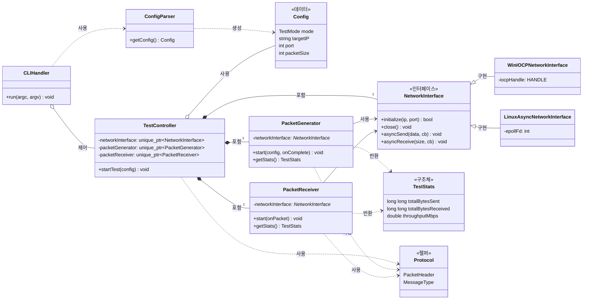

# 클래스 다이어그램 (Class Diagram)

이 문서는 `MyIperf` 프로젝트의 주요 클래스 구조와 관계를 설명합니다.

## 1. 다이어그램

## 2. 주요 클래스 설명

*   **`CLIHandler`**: 사용자의 명령줄 인수(argument)를 파싱하고, 그에 따라 `TestController`를 제어하여 테스트를 시작하는 역할을 합니다.
*   **`ConfigParser`**: JSON 설정 파일을 읽고 파싱하여 `Config` 객체를 생성합니다.
*   **`Config`**: 테스트 모드, 대상 IP, 포트, 패킷 크기 등 테스트에 필요한 모든 설정 값을 저장하는 데이터 클래스입니다.
*   **`TestController`**: 테스트의 전체 생명주기를 관리하는 핵심 클래스입니다. 상태 머신을 통해 테스트 상태를 관리하며, `NetworkInterface`, `PacketGenerator`, `PacketReceiver` 등 주요 컴포넌트들의 동작을 총괄합니다.
*   **`NetworkInterface`**: 네트워크 통신을 위한 추상 인터페이스입니다. 플랫폼에 따라 실제 구현이 달라집니다.
*   **`WinIOCPNetworkInterface`**: Windows의 IOCP를 사용하여 `NetworkInterface`를 구현한 클래스입니다.
*   **`LinuxAsyncNetworkInterface`**: Linux의 epoll을 사용하여 `NetworkInterface`를 구현한 클래스입니다.
*   **`PacketGenerator`**: 클라이언트 모드에서 설정에 따라 테스트 패킷을 생성하고 `NetworkInterface`를 통해 전송하는 역할을 합니다.
*   **`PacketReceiver`**: 네트워크로부터 데이터를 수신하고, 이를 완전한 패킷 단위로 조립 및 검증하며, 통계를 기록하는 역할을 합니다.
*   **`Protocol`**: `PacketHeader`, `MessageType` 등 통신 프로토콜과 관련된 규약들을 정의하는 헬퍼 클래스/네임스페이스입니다.
*   **`TestStats`**: 테스트 결과(총 전송/수신 바이트, 처리율 등)를 담는 구조체입니다.

## 3. 관계 설명

*   **제어 (Control)**: `CLIHandler`가 `TestController`의 `startTest` 같은 메서드를 호출하여 테스트 흐름을 제어합니다.
*   **포함 (Composition)**: `TestController`는 `NetworkInterface`, `PacketGenerator`, `PacketReceiver`의 인스턴스를 `unique_ptr`로 소유하며 생명주기를 관리합니다. `TestController`가 소멸하면 이들도 함께 소멸됩니다.
*   **사용 (Association/Dependency)**:
    *   `PacketGenerator`와 `PacketReceiver`는 `NetworkInterface`의 포인터를 받아 데이터를 보내거나 받습니다.
    *   여러 클래스들이 `Config` 객체를 참조하여 테스트 설정을 읽습니다.
*   **구현 (Realization)**: `WinIOCPNetworkInterface`와 `LinuxAsyncNetworkInterface`는 `NetworkInterface`라는 추상 인터페이스를 실제 기능으로 구현합니다.
