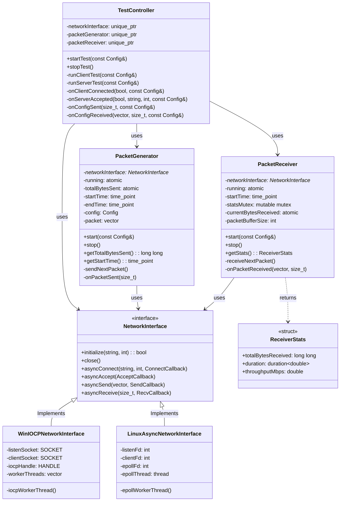

# Class Diagram

```mermaid
classDiagram
    class TestController {
        -networkInterface: unique_ptr<NetworkInterface>
        -packetGenerator: unique_ptr<PacketGenerator>
        -packetReceiver: unique_ptr<PacketReceiver>
        +startTest(const Config&)
        +stopTest()
        -runClientTest(const Config&)
        -runServerTest(const Config&)
        -onClientConnected(bool, const Config&)
        -onServerAccepted(bool, string, int, const Config&)
        -onConfigSent(size_t, const Config&)
        -onConfigReceived(vector, size_t, const Config&)
    }

    class NetworkInterface {
        <<interface>>
        +initialize(string, int): bool
        +close()
        +asyncConnect(string, int, ConnectCallback)
        +asyncAccept(AcceptCallback)
        +asyncSend(vector, SendCallback)
        +asyncReceive(size_t, RecvCallback)
    }

    class WinIOCPNetworkInterface {
        -listenSocket: SOCKET
        -clientSocket: SOCKET
        -iocpHandle: HANDLE
        -workerThreads: vector<thread>
        -iocpWorkerThread()
    }

    class LinuxAsyncNetworkInterface {
        -listenFd: int
        -clientFd: int
        -epollFd: int
        -epollThread: thread
        -epollWorkerThread()
    }

    class PacketGenerator {
        -networkInterface: NetworkInterface*
        -running: atomic<bool>
        -totalBytesSent: atomic<long long>
        -startTime: time_point
        -endTime: time_point
        -config: Config
        -packet: vector<char>
        +start(const Config&)
        +stop()
        +getTotalBytesSent(): long long
        +getStartTime(): time_point
        -sendNextPacket()
        -onPacketSent(size_t)
    }

    class PacketReceiver {
        -networkInterface: NetworkInterface*
        -running: atomic<bool>
        -startTime: time_point
        -statsMutex: mutable mutex
        -currentBytesReceived: atomic<long long>
        -packetBufferSize: int
        +start(const Config&)
        +stop()
        +getStats(): ReceiverStats
        -receiveNextPacket()
        -onPacketReceived(vector, size_t)
    }

    class ReceiverStats {
        <<struct>>
        +totalBytesReceived: long long
        +duration: duration~double~
        +throughputMbps: double
    }

    TestController --> NetworkInterface : uses
    TestController --> PacketGenerator : uses
    TestController --> PacketReceiver : uses
    PacketGenerator --> NetworkInterface : uses
    PacketReceiver --> NetworkInterface : uses
    PacketReceiver ..> ReceiverStats : returns
    NetworkInterface <|-- WinIOCPNetworkInterface : Implements
    NetworkInterface <|-- LinuxAsyncNetworkInterface : Implements
```
