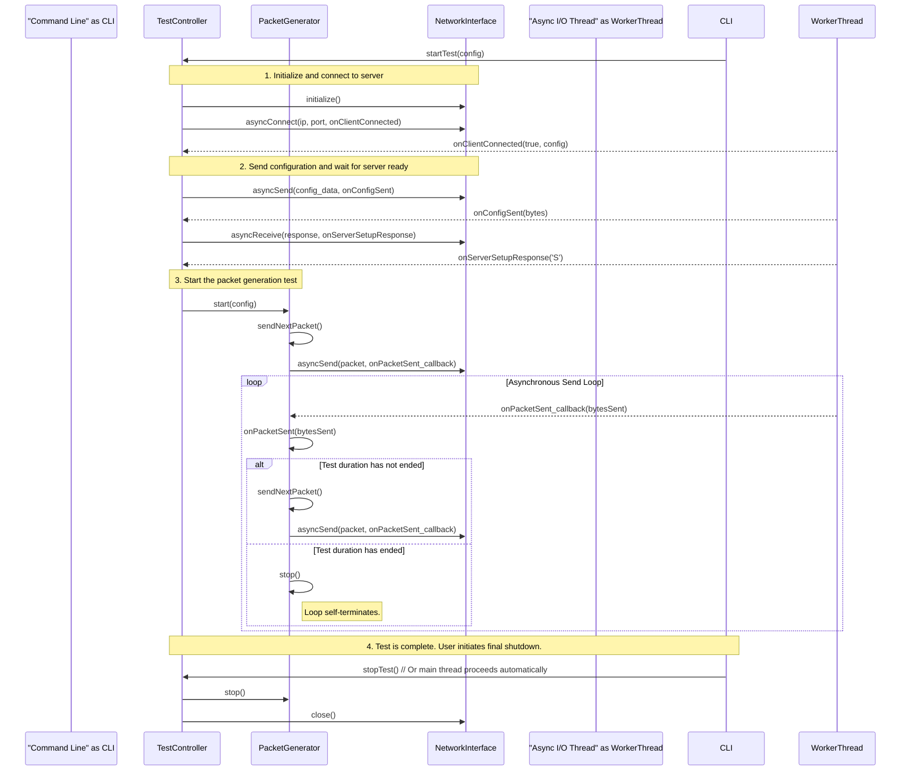

# Client Sequence Diagram (Async Chaining)

This diagram shows the flow of packet generation on the client side using the asynchronous chaining model.

```mermaid
sequenceDiagram
    participant "Command Line" as CLI
    participant TestController
    participant PacketGenerator
    participant NetworkInterface
    participant "Async I/O Thread" as WorkerThread

    CLI->>TestController: startTest(config) 

    Note over TestController, NetworkInterface: 1. Initialize and connect to server
    TestController->>NetworkInterface: initialize()
    TestController->>NetworkInterface: asyncConnect(ip, port, onClientConnected)
    WorkerThread-->>TestController: onClientConnected(true, config)

    Note over TestController, NetworkInterface: 2. Send configuration and wait for server ready
    TestController->>NetworkInterface: asyncSend(config_data, onConfigSent)
    WorkerThread-->>TestController: onConfigSent(bytes)
    TestController->>NetworkInterface: asyncReceive(response, onServerSetupResponse)
    WorkerThread-->>TestController: onServerSetupResponse('S')
    
    Note over TestController, PacketGenerator: 3. Start the packet generation test
    TestController->>PacketGenerator: start(config)
    PacketGenerator->>PacketGenerator: sendNextPacket()
    PacketGenerator->>NetworkInterface: asyncSend(packet, onPacketSent_callback)
    
    loop Asynchronous Send Loop
        WorkerThread-->>PacketGenerator: onPacketSent_callback(bytesSent)
        PacketGenerator->>PacketGenerator: onPacketSent(bytesSent)
        
        alt Test duration has not ended
            PacketGenerator->>PacketGenerator: sendNextPacket()
            PacketGenerator->>NetworkInterface: asyncSend(packet, onPacketSent_callback)
        else Test duration has ended
            PacketGenerator->>PacketGenerator: stop()
            Note right of PacketGenerator: Loop self-terminates.
        end
    end

    Note over CLI, TestController: 4. Test is complete. User initiates final shutdown.
    CLI->>TestController: stopTest() // Or main thread proceeds automatically
    TestController->>PacketGenerator: stop()
    TestController->>NetworkInterface: close()
```