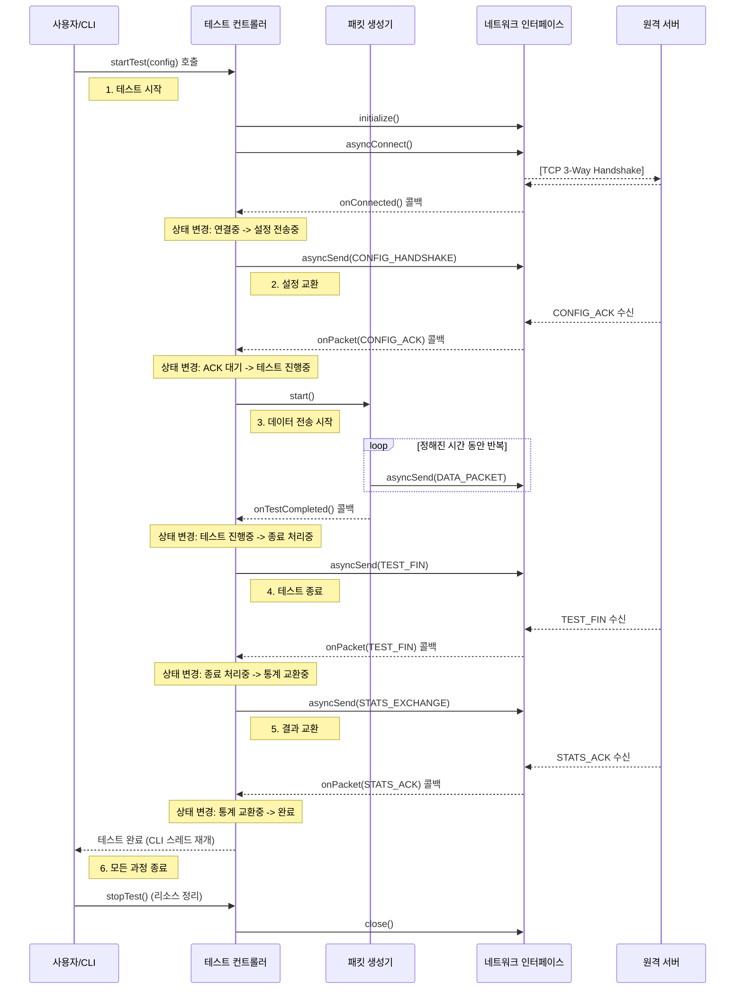

# 클라이언트 동작 시퀀스 다이어그램

이 문서는 `MyIperf` 클라이언트가 실행된 후 테스트를 완료하기까지의 내부 컴포넌트 간 상호작용과 메시지 흐름을 순서대로 보여줍니다.

## 1. 다이어그램

## 2. 시퀀스 설명

1.  **테스트 시작**:
    *   사용자가 CLI 명령을 실행하면 `CLIHandler`가 `TestController`의 `startTest()`를 호출하여 테스트를 시작합니다.

2.  **연결 및 설정 교환**:
    *   `TestController`는 `NetworkInterface`를 초기화하고, `asyncConnect()`를 호출하여 서버에 비동기 연결을 시도합니다.
    *   TCP 연결이 성공하면 `onConnected` 콜백이 호출됩니다.
    *   `TestController`는 서버에게 테스트 설정을 담은 `CONFIG_HANDSHAKE` 메시지를 전송합니다.
    *   서버로부터 설정이 정상적으로 수신되었다는 `CONFIG_ACK` 메시지를 받으면, `TestController`는 상태를 '테스트 진행중'으로 변경합니다.

3.  **데이터 전송**:
    *   `TestController`가 `PacketGenerator`를 시작시킵니다.
    *   `PacketGenerator`는 설정된 테스트 시간 동안 `NetworkInterface`를 통해 `DATA_PACKET`을 계속해서 비동기 전송합니다.

4.  **테스트 종료**:
    *   테스트 시간이 만료되면 `PacketGenerator`는 `onTestCompleted` 콜백을 통해 `TestController`에게 완료를 알립니다.
    *   `TestController`는 테스트 데이터 전송이 끝났음을 알리기 위해 서버로 `TEST_FIN` 메시지를 보냅니다.

5.  **결과 교환**:
    *   클라이언트는 서버로부터 `TEST_FIN` 메시지를 수신하여 서버 역시 테스트가 끝났음을 확인합니다.
    *   `TestController`는 자신의 테스트 통계를 `STATS_EXCHANGE` 메시지에 담아 서버로 전송합니다.
    *   서버로부터 통계 수신 확인을 의미하는 `STATS_ACK`를 받으면 모든 교환 과정이 완료됩니다.

6.  **최종 종료**:
    *   `TestController`는 대기 중이던 메인 CLI 스레드를 재개시키고, `stopTest()`가 호출되어 모든 네트워크 리소스를 정리하고 프로그램을 종료합니다.
