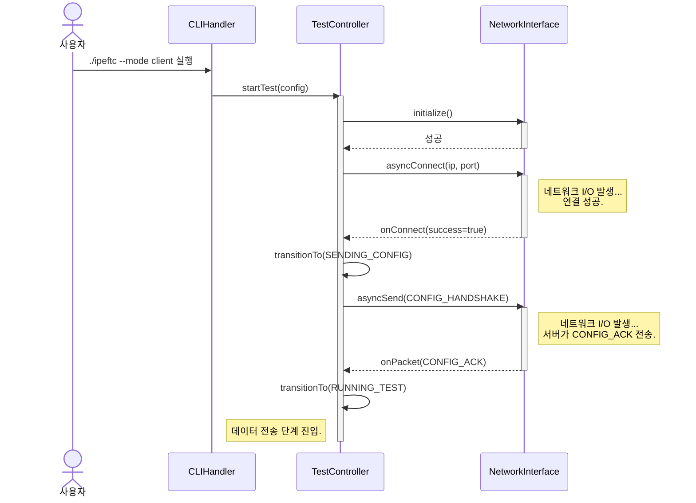

# MyIperf 통신 다이어그램

이 문서는 특정 목표를 달성하기 위해 시스템의 객체 간 시간 순서에 따른 상호작용을 보여주는 시퀀스 다이어그램을 사용합니다. 이는 UML 통신 다이어그램의 현대적인 대안입니다.

## 1. 통신 (시퀀스) 다이어그램

이 다이어그램은 특정 작업을 수행하기 위해 객체 간에 교환되는 메시지 시퀀스를 보여줍니다. 클라이언트 측에서 연결을 시작하고 구성 핸드셰이크를 수행하는 과정에 중점을 둡니다.

## 2. 시퀀스 설명

이 다이어그램은 사용자의 명령어 입력부터 데이터 전송 단계 시작까지, 클라이언트가 테스트를 시작하는 단계별 프로세스를 보여줍니다.

*   **참여자**
    *   `사용자`: 프로그램을 실행하는 사람.
    *   `CLIHandler`: 명령줄 인수를 파싱하는 객체.
    *   `TestController (TC)`: 테스트 상태를 관리하는 중앙 오케스트레이터.
    *   `NetworkInterface (NI)`: 플랫폼별 네트워킹 호출을 추상화하는 객체.

*   **상호작용 흐름**
    1.  **실행**: `사용자`가 클라이언트 모드 인수로 실행 파일을 실행합니다.
    2.  **테스트 시작**: `CLIHandler`가 이 인수들을 `Config` 객체로 파싱하고 `TestController`의 `startTest()`를 호출합니다. `TestController`가 활성화됩니다.
    3.  **네트워크 초기화**: `TestController`가 먼저 `NetworkInterface`를 초기화하여 필요한 리소스(예: Windows의 IOCP 핸들)를 설정합니다.
    4.  **연결**: `TestController`가 `NetworkInterface`의 `asyncConnect()`를 호출하여 서버에 비동기 연결을 시작합니다.
    5.  **연결 콜백**: `NetworkInterface`가 연결을 시도하고, 성공 시 `TestController`가 제공한 콜백 함수(`onConnect`로 표현됨)를 호출합니다.
    6.  **구성 전송**: 연결된 `TestController`는 내부 상태를 `SENDING_CONFIG`로 전환하고, `asyncSend()`를 통해 `CONFIG_HANDSHAKE` 패킷에 테스트 매개변수를 담아 서버로 전송합니다.
    7.  **응답 수신**: `NetworkInterface`가 데이터를 수신 대기하다 서버의 `CONFIG_ACK` 패킷을 받으면, 이를 `TestController`의 `onPacket()` 핸들러로 전달합니다.
    8.  **테스트 시작**: `CONFIG_ACK`를 수신하면 `TestController`는 핸드셰이크가 완료되었음을 인지합니다. 상태를 `RUNNING_TEST`로 전환하고, 주 데이터 전송 단계가 시작됩니다. 이제 컨트롤러는 테스트 지속 시간이 완료되기를 기다립니다.