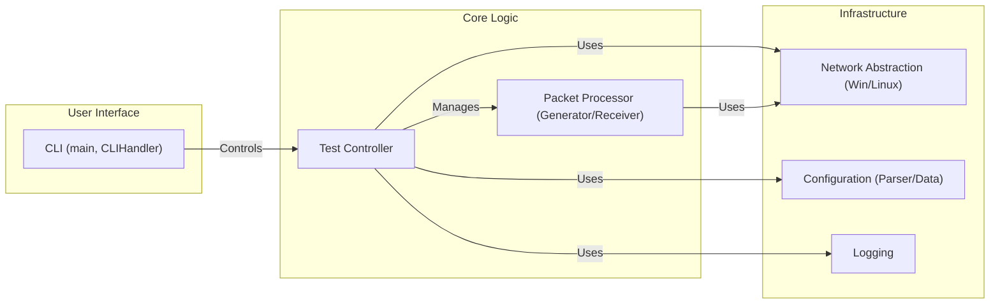

# 컴포넌트 다이어그램

이 문서는 `MyIperf`를 구성하는 주요 소프트웨어 컴포넌트와 그 의존성을 설명합니다.

## 1. 다이어그램

## 2. 컴포넌트 설명

*   **CLI (Command Line Interface)**
    *   **역할**: 진입점이자 사용자 상호작용 계층 역할을 합니다.
    *   **기능**: 명령줄 인수를 구문 분석하고, 사용자 입력을 검증하며, `Test Controller`를 사용하여 테스트를 시작하거나 도움말 정보를 표시합니다.
    *   **주요 파일**: `main.cpp`, `CLIHandler.h/cpp`

*   **Test Controller**
    *   **역할**: 애플리케이션의 중앙 오케스트레이터로서 전체 테스트 흐름을 관리합니다.
    *   **기능**: 테스트 수명 주기(설정, 핸드셰이크, 데이터 전송, 통계 교환, 종료)를 관리하기 위해 상태 머신을 구현합니다. 테스트를 올바르게 실행하기 위해 다른 모든 코어 및 인프라 컴포넌트를 조정합니다.
    *   **주요 파일**: `TestController.h/cpp`

*   **Packet Processor**
    *   **역할**: 테스트 데이터 패킷의 생성 및 수신을 담당합니다.
    *   **기능**: 두 가지 주요 하위 컴포넌트로 구성됩니다:
        *   `PacketGenerator`: 설정된 속도로 데이터 패킷을 생성하고 전송합니다.
        *   `PacketReceiver`: 들어오는 데이터 패킷을 수신, 검증 및 처리하여 패킷 손실 및 체크섬 오류와 같은 통계를 계산합니다.
    *   **주요 파일**: `PacketGenerator.h/cpp`, `PacketReceiver.h/cpp`

*   **Network Abstraction**
    *   **역할**: 플랫폼별 세부 정보를 추상화하여 저수준 네트워크 통신을 위한 일관된 인터페이스를 제공합니다.
    *   **기능**: `NetworkInterface`는 추상 API를 정의합니다. `WinIOCPNetworkInterface`(IOCP 사용) 및 `LinuxAsyncNetworkInterface`(epoll 사용)는 각 운영 체제에 대해 구체적이고 고성능의 비동기 구현을 제공합니다.
    *   **주요 파일**: `NetworkInterface.h`, `WinIOCPNetworkInterface.h/cpp`, `LinuxAsyncNetworkInterface.h/cpp`

*   **Configuration**
    *   **역할**: 모든 애플리케이션 설정을 관리합니다.
    *   **기능**: `Config` 클래스는 테스트 매개변수(모드, IP, 포트 등)를 보유합니다. `ConfigParser`는 JSON 파일에서 설정을 읽으며, 이는 명령줄 인수로 재정의될 수 있습니다.
    *   **주요 파일**: `Config.h/cpp`, `ConfigParser.h/cpp`

*   **Logging**
    *   **역할**: 프로그램의 작동 상태, 테스트 결과 및 오류를 기록합니다.
    *   **기능**: 실시간 모니터링을 위해 콘솔, 로그 파일 및 명명된 파이프(Windows)에 메시지를 출력할 수 있는 스레드 안전한 비동기 로깅 서비스(`Logger`)를 제공합니다.
    *   **주요 파일**: `Logger.h/cpp`

## 3. 관계

*   `CLI`는 사용자 명령에 따라 `Test Controller`를 구동합니다.
*   `Test Controller`는 중앙 허브로서 `Packet Processor`를 관리하고 `Network Abstraction`, `Configuration` 및 `Logging` 컴포넌트를 사용하여 작업을 수행합니다.
*   `Packet Processor`는 생성하거나 처리하는 패킷을 보내고 받기 위해 `Network Abstraction`에 의존합니다.
