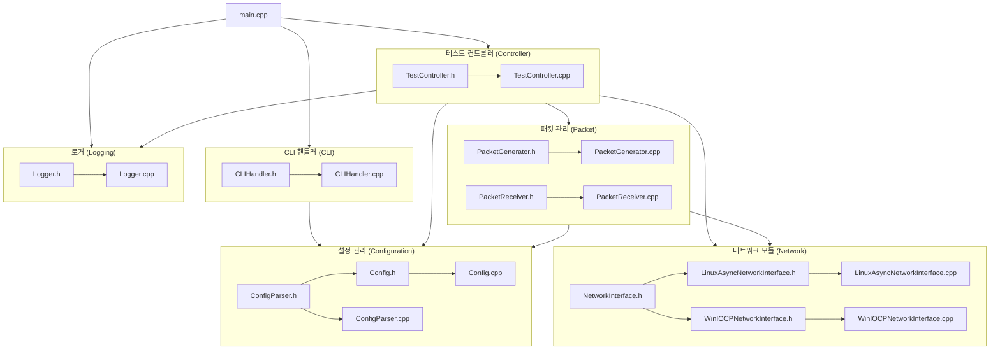

```mermaid
graph TD
    subgraph NetworkModule ["네트워크 모듈 (Network)"]
        direction LR
        NetworkInterface_h[NetworkInterface.h]
        LinuxAsyncNetworkInterface_h[LinuxAsyncNetworkInterface.h]
        LinuxAsyncNetworkInterface_cpp[LinuxAsyncNetworkInterface.cpp]
        WinIOCPNetworkInterface_h[WinIOCPNetworkInterface.h]
        WinIOCPNetworkInterface_cpp[WinIOCPNetworkInterface.cpp]
        
        NetworkInterface_h --> LinuxAsyncNetworkInterface_h
        NetworkInterface_h --> WinIOCPNetworkInterface_h
        LinuxAsyncNetworkInterface_h --> LinuxAsyncNetworkInterface_cpp
        WinIOCPNetworkInterface_h --> WinIOCPNetworkInterface_cpp
    end

    subgraph PacketManager ["패킷 관리 (Packet)"]
        direction LR
        PacketGenerator_h[PacketGenerator.h]
        PacketGenerator_cpp[PacketGenerator.cpp]
        PacketReceiver_h[PacketReceiver.h]
        PacketReceiver_cpp[PacketReceiver.cpp]
        
        PacketGenerator_h --> PacketGenerator_cpp
        PacketReceiver_h --> PacketReceiver_cpp
    end

    subgraph Controller ["테스트 컨트롤러 (Controller)"]
        direction LR
        TestController_h[TestController.h]
        TestController_cpp[TestController.cpp]
        
        TestController_h --> TestController_cpp
    end

    subgraph CLIHandler ["CLI 핸들러 (CLI)"]
        direction LR
        CLIHandler_h[CLIHandler.h]
        CLIHandler_cpp[CLIHandler.cpp]
        
        CLIHandler_h --> CLIHandler_cpp
    end

    subgraph ConfigModule ["설정 관리 (Configuration)"]
        direction LR
        Config_h[Config.h]
        Config_cpp[Config.cpp]
        ConfigParser_h[ConfigParser.h]
        ConfigParser_cpp[ConfigParser.cpp]

        ConfigParser_h --> Config_h
        Config_h --> Config_cpp
        ConfigParser_h --> ConfigParser_cpp
    end

    subgraph LoggerModule ["로거 (Logging)"]
        direction LR
        Logger_h[Logger.h]
        Logger_cpp[Logger.cpp]
        
        Logger_h --> Logger_cpp
    end

    Main_cpp[main.cpp]
    
    Main_cpp --> CLIHandler
    Main_cpp --> Controller
    Main_cpp --> LoggerModule
    
    CLIHandler --> ConfigModule

    Controller --> NetworkModule
    Controller --> PacketManager
    Controller --> ConfigModule
    Controller --> LoggerModule
    
    PacketManager --> NetworkModule
    PacketManager --> ConfigModule
```