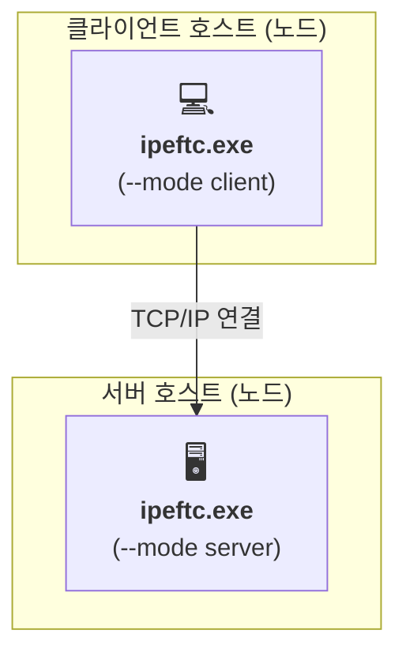

# MyIperf 배포 다이어그램

이 문서는 런타임 시 `MyIperf` 애플리케이션 구성 요소의 물리적 또는 가상 배포를 보여줍니다.

## 1. 배포 다이어그램 (Mermaid)

## 2. 배포 설명

이 다이어그램은 `MyIperf` 애플리케이션의 물리적 배포를 보여줍니다. 동일한 애플리케이션 아티팩트가 두 개의 개별 머신(노드)에서 실행되는 전형적인 클라이언트-서버 모델입니다.

*   ### 노드

    *   **클라이언트 호스트**: 사용자가 테스트를 시작하는 물리적 또는 가상 머신입니다. 지원되는 운영 체제(Windows 또는 Linux)를 실행하는 모든 일반 컴퓨터가 될 수 있습니다.
    *   **서버 호스트**: 성능 테스트의 대상 역할을 하는 물리적 또는 가상 머신입니다. 데이터 센터의 서버이거나 네트워크 상의 다른 컴퓨터일 수 있으며, 역시 지원되는 OS를 실행합니다.

*   ### 아티팩트

    *   **`ipeftc.exe`**: `MyIperf` 애플리케이션을 위한 단일 컴파일된 실행 파일입니다. 동일한 아티팩트가 클라이언트와 서버 호스트 모두에 배포됩니다. 그 동작은 런타임 시 `--mode` 명령줄 인수에 의해 결정됩니다.
        *   클라이언트 호스트에서는 `--mode client`로 실행됩니다.
        *   서버 호스트에서는 `--mode server`로 실행됩니다.

*   ### 통신 경로
    *   **TCP/IP 연결**: `ipeftc.exe`의 클라이언트 및 서버 인스턴스는 표준 TCP/IP 네트워크를 통해 통신합니다. 클라이언트는 지정된 포트에서 서버로의 연결을 시작하며, 모든 제어 메시지와 테스트 데이터가 이 연결을 통해 교환됩니다.