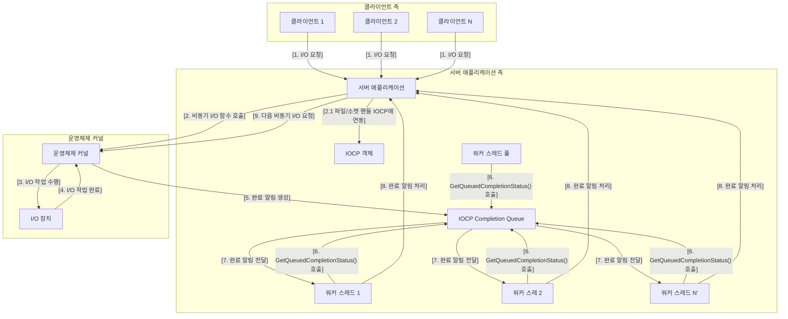

```mermaid
graph TD
    subgraph 클라이언트 측
        A[클라이언트 1]
        B[클라이언트 2]
        C[클라이언트 N]
    end

    subgraph 서버 애플리케이션 측
        D[서버 애플리케이션]
        E[IOCP 객체]
        F[IOCP Completion Queue]
        G[워커 스레드 풀]
        H[워커 스레드 1]
        I[워커 스레 2]
        J[워커 스레드 N']
    end

    subgraph 운영체제 커널
        K[운영체제 커널]
        L[I/O 장치]
    end

    A -- [1. I/O 요청] --> D
    B -- [1. I/O 요청] --> D
    C -- [1. I/O 요청] --> D

    D -- [2. 비동기 I/O 함수 호출] --> K
    D -- [2.1 파일/소켓 핸들 IOCP에 연동] --> E

    K -- [3. I/O 작업 수행] --> L
    L -- [4. I/O 작업 완료] --> K
    K -- [5. 완료 알림 생성] --> F

    G -- [6. GetQueuedCompletionStatus() 호출] --> F
    H -- [6. GetQueuedCompletionStatus() 호출] --> F
    I -- [6. GetQueuedCompletionStatus() 호출] --> F
    J -- [6. GetQueuedCompletionStatus() 호출] --> F

    F -- [7. 완료 알림 전달] --> H
    F -- [7. 완료 알림 전달] --> I
    F -- [7. 완료 알림 전달] --> J

    H -- [8. 완료 알림 처리] --> D
    I -- [8. 완료 알림 처리] --> D
    J -- [8. 완료 알림 처리] --> D

    D -- [9. 다음 비동기 I/O 요청] --> K
```