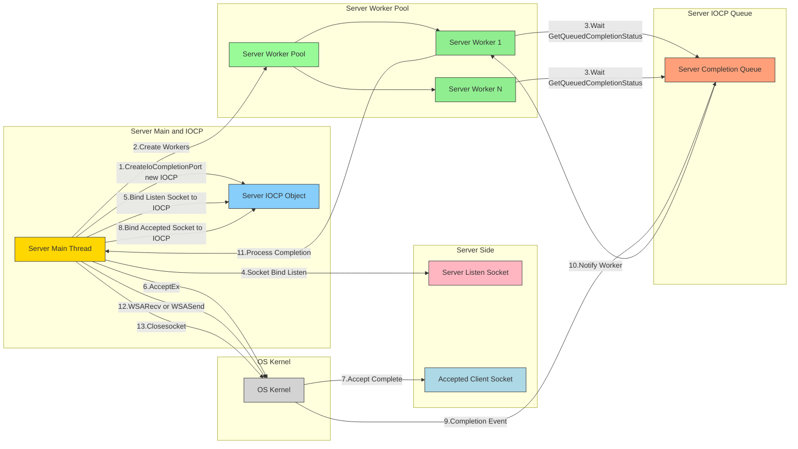
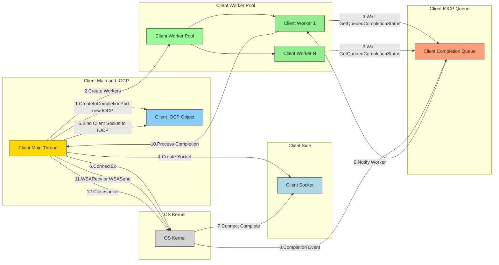

# IOCP (I/O Completion Port) 상세 설명

IOCP는 Windows 운영체제에서 고성능 I/O 작업을 위해 제공하는 핵심 커널 객체이자 프로그래밍 모델입니다. 이 문서는 IOCP의 핵심 개념과 함께, 서버와 클라이언트 양측에서의 활용 방식과 그 차이점을 상세히 설명합니다.

## 1. IOCP의 핵심 개념

전통적인 I/O 모델(Blocking, Non-blocking)은 다수의 클라이언트를 처리할 때 스레드 개수가 급증하거나, 비효율적인 폴링(polling)으로 인해 CPU 자원을 낭비하는 문제가 있습니다. IOCP는 이러한 문제를 해결하기 위해 **"비동기 I/O 작업의 완료를 효율적으로 관리"** 하는 데 초점을 맞춥니다.

- **비동기(Asynchronous) I/O**: I/O 작업을 요청한 스레드는 작업이 완료될 때까지 기다리지 않고 즉시 다른 작업을 수행합니다. 실제 I/O 처리는 운영체제(커널)가 백그라운드에서 담당합니다.
- **완료 통지(Completion Notification)**: I/O 작업이 완료되면, 운영체제는 그 결과를 미리 지정된 "완료 큐(Completion Queue)"에 넣습니다. 애플리케이션은 이 큐만 감시하면 됩니다.

이 모델을 통해 애플리케이션은 I/O 작업 자체에 관여하지 않고, 오직 "완료된 I/O 작업의 후처리"에만 집중할 수 있어 매우 효율적입니다.

## 2. IOCP 구성 요소와 일반적인 동작 흐름

아래 다이어그램은 IOCP 모델의 전체적인 흐름을 보여줍니다. 이 모델은 서버와 클라이언트 모두에게 동일하게 적용되는 원리입니다.

## 2.1. 서버 IOCP 다이어그램

서버는 **Listen Socket**과 개별 클라이언트와 통신하는 **Accepted Socket**이 분리되어 동작합니다.

### 2.2. 클라이언트 IOCP 다이어그램

## 3. 서버와 클라이언트에서의 IOCP 활용

IOCP는 주로 서버의 확장성을 위해 사용되지만, 클라이언트에서도 I/O 성능을 극대화하고 반응성을 높이기 위해 매우 유용하게 사용됩니다.

### 3.1. 서버 측 활용 (고확장성)

서버에서 IOCP를 사용하는 주된 이유는 **수많은 동시 연결을 최소한의 스레드로 관리**하기 위함입니다.

-   **주요 작업**: `Accept` (새 클라이언트 연결), `Recv` (데이터 수신), `Send` (데이터 송신)
-   **동작 방식**:
    1.  서버는 리슨 소켓을 생성하고, 이를 IOCP에 연결하지는 않습니다.
    2.  `AcceptEx()`를 호출하여 클라이언트의 연결 요청을 비동기적으로 받기 시작합니다.
    3.  새로운 클라이언트가 연결되면, 생성된 **클라이언트 소켓**을 IOCP에 연동시킵니다.
    4.  이후 해당 클라이언트와의 모든 데이터 송수신(`WSASend`, `WSARecv`)은 IOCP를 통해 비동기적으로 관리됩니다.
-   **핵심 장점**: 워커 스레드 풀이 수천, 수만 개의 클라이언트 소켓에 대한 I/O 완료를 효율적으로 처리합니다. 각 연결마다 스레드를 할당하는 모델(`Thread-per-client`)에 비해 훨씬 적은 수의 스레드로 월등한 성능을 보여주며, 컨텍스트 스위칭 비용을 최소화합니다.

### 3.2. 클라이언트 측 활용 (고성능 및 반응성)

클라이언트는 보통 하나의 서버에만 연결하지만, IOCP는 다음과 같은 중요한 이점을 제공합니다.

-   **주요 작업**: `Connect` (서버 연결), `Send` (데이터 송신), `Recv` (데이터 수신)
-   **동작 방식**:
    1.  클라이언트는 서버에 연결할 소켓을 생성하고, 이 소켓을 IOCP에 연동합니다.
    2.  `ConnectEx()`를 사용하여 서버에 비동기적으로 연결을 시도합니다.
    3.  연결이 성공적으로 완료되면, 이 사실이 IOCP 완료 큐를 통해 통지됩니다.
    4.  이후 서버와의 모든 데이터 송수신(`WSASend`, `WSARecv`)은 IOCP를 통해 비동기적으로 처리됩니다.
-   **핵심 장점**:
    -   **UI/메인 스레드 블로킹 방지**: 만약 클라이언트에 GUI나 실시간 렌더링 로직(게임 등)이 있다면, 네트워크 I/O 작업으로 인해 메인 스레드가 멈추는 현상(Blocking)을 완벽하게 방지할 수 있습니다. 모든 I/O 작업은 백그라운드에서 일어나고, 워커 스레드가 그 완료만을 처리하므로 애플리케이션의 반응성이 극대화됩니다.
    -   **코드 일관성**: `WinIOCPNetworkInterface`와 같이 서버와 클라이언트가 동일한 고성능 네트워크 인터페이스 구현을 공유할 수 있어 코드베이스가 단순화되고 유지보수가 용이해집니다.
    -   **고성능 데이터 처리**: 이 프로젝트(`MyIperf`)처럼 짧은 시간 안에 대량의 데이터를 보내거나 받아야 하는 성능 테스트 클라이언트의 경우, 비동기 송수신 처리는 필수적입니다. IOCP는 이러한 작업을 가장 효율적으로 처리하는 Windows 표준 방식입니다.

## 4. 결론

-   **서버의 IOCP**: 다수의 연결을 효율적으로 관리하여 **확장성(Scalability)**을 확보하는 것이 주 목적입니다.
-   **클라이언트의 IOCP**: 단일 연결의 I/O 작업을 비동기적으로 처리하여 **반응성(Responsiveness)과 처리율(Throughput)**을 높이는 것이 주 목적입니다.

결론적으로 IOCP는 서버뿐만 아니라 고성능을 요구하는 클라이언트 애플리케이션에도 매우 효과적인 I/O 모델입니다.