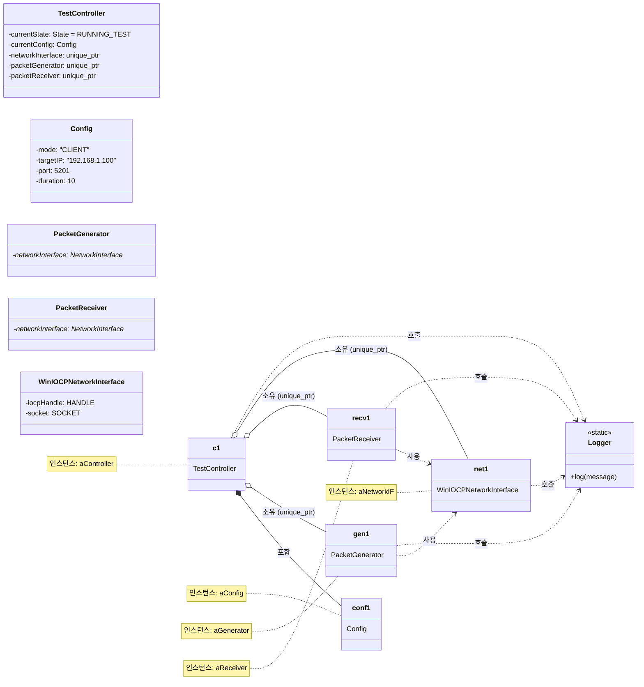

# MyIperf 객체 다이어그램

이 문서는 특정 시점의 시스템 인스턴스 및 그 관계를 보여주는 스냅샷인 객체 다이어그램을 제시합니다. 이는 실행 중에 클래스가 어떻게 인스턴스화되고 연결되는지에 대한 구체적인 뷰를 제공합니다.

## 1. 객체 다이어그램 (Mermaid)

이 다이어그램은 `RUNNING_TEST` 단계 동안 **클라이언트 측** 시스템 상태의 스냅샷을 보여줍니다.

## 2. 객체 및 링크 설명

이 객체 다이어그램은 `MyIperf` 클라이언트가 활발히 테스트를 실행하는 특정 순간을 포착합니다. 다이어그램은 메모리에 인스턴스화된 객체와 그들 사이의 링크를 보여줍니다.

*   ### 객체 (인스턴스)

    *   **`aController: TestController`**: 테스트를 총괄하는 중앙 객체입니다. `currentState`는 `RUNNING_TEST`입니다. 테스트 구성을 보유하고 다른 주요 구성 요소를 소유합니다.
    *   **`aConfig: Config`**: 테스트의 런타임 구성을 보유하는 객체입니다. 속성은 클라이언트 모드, 서버 IP, 테스트 시간과 같은 예제 값으로 채워져 있습니다.
    *   **`aGenerator: PacketGenerator`**: 테스트 데이터 패킷을 생성하고 보내는 역할을 하는 객체입니다. 현재 `aConfig`의 매개변수에 따라 패킷을 생성하며 활성 상태입니다.
    *   **`aReceiver: PacketReceiver`**: 제어 메시지(`CONFIG_ACK`, `TEST_FIN` 등)와 같은 서버로부터 들어오는 패킷을 수신 대기하는 객체입니다.
    *   **`aNetworkIF: WinIOCPNetworkInterface`**: 고성능 비동기 I/O를 위해 IOCP를 사용하는 Windows용 네트워크 인터페이스의 구체적인 인스턴스입니다. 기본 소켓 및 I/O 작업을 관리합니다.
    *   **`Logger`**: 로깅 서비스를 제공하는 정적 클래스입니다. 인스턴스화되지 않지만 다른 많은 객체에서 이벤트 정보를 기록하는 데 사용됩니다.

*   ### 링크 (관계)

    *   **`aController` -> `aConfig` (포함)**: `TestController`는 `Config` 객체와 컴포지션 관계를 가집니다. 즉, 현재 테스트에 대한 구성 데이터를 직접 포함합니다.
    *   **`aController` -> `aGenerator`, `aReceiver`, `aNetworkIF` (소유)**: `TestController`는 `std::unique_ptr`를 통해 생성기, 수신기 및 네트워크 인터페이스 객체를 소유합니다. 이는 `aController`가 이들의 생명주기를 제어함을 의미합니다. `aController`가 소멸되면 이 구성 요소들도 자동으로 소멸됩니다.
    *   **`aGenerator` / `aReceiver` -> `aNetworkIF` (사용)**: `PacketGenerator`와 `PacketReceiver` 모두 `WinIOCPNetworkInterface` 인스턴스에 대한 원시 포인터를 받습니다. 이들은 네트워크 객체를 소유하지 않고 이 링크를 사용하여 각각의 송신 및 수신 작업을 수행합니다.
    *   **`(all)` -> `Logger` (호출)**: 시스템 전반의 다양한 객체들이 `Logger` 클래스의 정적 `log()` 메서드를 호출하여 정보 또는 오류 메시지를 콘솔 및 로그 파일에 씁니다.