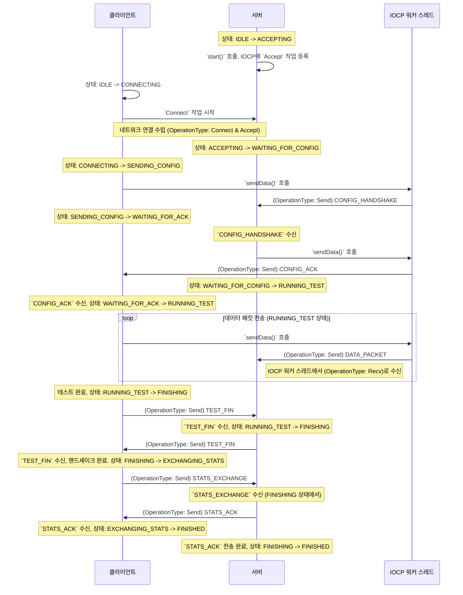

## 요약: 상태 전환 표

`TestController`의 핵심 로직은 상태 머신에 의해 결정됩니다. 아래 표는 주요 상태, 해당 상태에서 발생하는 이벤트, 그리고 그에 따른 다음 상태를 요약한 것입니다.

| 현재 상태 (Current State) | 이벤트 (Event) | 주요 동작 (Action) | 다음 상태 (Next State) |
| :--- | :--- | :--- | :--- |
| **(공통)** | | | |
| `IDLE` (대기) | `startTest(client)` | `asyncConnect()` 호출 | `CONNECTING` (연결중) |
| `IDLE` (대기) | `startTest(server)` | `asyncAccept()` 호출 | `ACCEPTING` (수락대기) |
| **(클라이언트)** | | | |
| `CONNECTING` (연결중) | `onConnected` 콜백 | `CONFIG_HANDSHAKE` 전송 | `SENDING_CONFIG` (설정전송) |
| `SENDING_CONFIG` (설정전송) | `onSent` 콜백 | - | `WAITING_FOR_ACK` (ACK대기) |
| `WAITING_FOR_ACK` (ACK대기) | `CONFIG_ACK` 수신 | `PacketGenerator.start()` | `RUNNING_TEST` (테스트진행) |
| `RUNNING_TEST` (테스트진행) | 테스트 시간 종료 | `TEST_FIN` 전송 | `FINISHING` (종료처리중) |
| `FINISHING` (종료처리중) | `TEST_FIN` 수신 | `STATS_EXCHANGE` 전송 | `EXCHANGING_STATS` (통계교환) |
| `EXCHANGING_STATS` (통계교환) | `STATS_ACK` 수신 | 테스트 종료 처리 | `FINISHED` (완료) |
| **(서버)** | | | |
| `ACCEPTING` (수락대기) | `onAccepted` 콜백 | `asyncReceive()` 호출 | `WAITING_FOR_CONFIG` (설정대기) |
| `WAITING_FOR_CONFIG` (설정대기) | `CONFIG_HANDSHAKE` 수신| `CONFIG_ACK` 전송 | `RUNNING_TEST` (테스트진행) |
| `RUNNING_TEST` (테스트진행) | `TEST_FIN` 수신 | `TEST_FIN` 응답 전송 | `FINISHING` (종료처리중) |
| `FINISHING` (종료처리중) | `STATS_EXCHANGE` 수신| `STATS_ACK` 전송 | `FINISHED` (완료) |

---

# OperationType, messageType, State의 관계

이 문서는 제공된 코드베이스 내에서 네트워크 통신과 테스트 로직을 구성하는 세 가지 핵심 개념인 OperationType, messageType, 그리고 State의 상호작용을 설명합니다.

## 1. OperationType

OperationType은 네트워크 인터페이스의 비동기 I/O 작업 유형을 나타내는 열거형(enum)입니다. 이것은 시스템의 저수준(low-level) 동작을 정의하며, IOCP 워커 스레드가 완료된 I/O 요청을 처리하는 데 사용됩니다.

- **Recv**: 연결된 소켓으로부터 데이터를 비동기적으로 수신하는 작업입니다.
- **Send**: 연결된 소켓에 데이터를 비동기적으로 전송하는 작업입니다.
- **Accept**: 서버가 클라이언트의 새로운 연결 요청을 비동기적으로 수락하는 작업입니다.
- **Connect**: 클라이언트가 서버에 연결을 비동기적으로 시도하는 작업입니다.

IOCP 워커 스레드는 `GetQueuedCompletionStatus`를 통해 완료된 I/O 요청을 받으면, 요청에 포함된 `OperationType`을 확인하여 적절한 후속 조치를 취합니다.

## 2. messageType

`messageType`은 애플리케이션 계층에서 정의된 통신 프로토콜의 메시지 유형을 나타냅니다. 이는 시스템의 고수준(high-level) 로직에 해당하며, 클라이언트와 서버가 서로 어떤 종류의 데이터를 교환하는지를 정의합니다.

- **CONFIG_HANDSHAKE**: 클라이언트가 테스트 설정을 담아 서버로 보내는 메시지입니다.
- **CONFIG_ACK**: 서버가 클라이언트의 설정 메시지를 받았음을 확인하기 위해 보내는 메시지입니다.
- **DATA_PACKET**: 실제 성능 테스트에 사용되는 데이터 패킷입니다.
- **TEST_FIN**: 데이터 전송 단계가 완료되었음을 알리기 위해 한쪽에서 다른 쪽으로 보내는 신호입니다.
- **STATS_EXCHANGE**: 테스트가 완료된 후 성능 통계를 교환하기 위해 보내는 메시지입니다.
- **STATS_ACK**: 통계 메시지를 받았음을 확인하기 위해 보내는 메시지입니다.

`messageType`은 네트워크를 통해 전송되는 실제 데이터 패킷의 헤더에 포함되어, 수신 측이 패킷의 목적을 이해하고 적절한 비즈니스 로직을 실행할 수 있게 해줍니다.

## 3. State

`State`는 `TestController`가 현재 어떤 단계에 있는지를 나타내는 상태(state)입니다. 이는 테스트의 흐름을 관리하는 상태 머신(state machine)의 핵심 요소입니다.

- **IDLE**: 테스트가 시작되기 전의 초기 상태입니다.
- **INITIALIZING**: 새로운 테스트를 위한 리소스를 설정하는 중입니다.
- **CONNECTING**: 클라이언트가 서버에 연결을 시도하는 중입니다.
- **SENDING_CONFIG**: 클라이언트가 서버로 테스트 설정을 보내는 중입니다.
- **WAITING_FOR_ACK**: 클라이언트가 서버의 설정 확인 응답을 기다리는 중입니다.
- **ACCEPTING**: 서버가 클라이언트의 연결을 기다리는 중입니다.
- **WAITING_FOR_CONFIG**: 서버가 클라이언트의 테스트 설정을 기다리는 중입니다.
- **RUNNING_TEST**: 실제 데이터 전송 테스트가 진행 중인 상태입니다.
- **FINISHING**: 데이터 전송이 끝난 후, 양측이 종료를 확인하는 핸드셰이크를 진행하는 상태입니다.
- **EXCHANGING_STATS**: 핸드셰이크가 끝난 후 클라이언트와 서버가 통계 정보를 교환하는 중입니다.
- **FINISHED**: 테스트가 성공적으로 완료된 상태입니다.
- **ERRORED**: 복구 불가능한 오류가 발생한 상태입니다.

`TestController`는 `State`를 기반으로 다음 동작을 결정하며, `messageType`에 따라 상태를 전이시킵니다.

## 4. 관계 다이어그램

`OperationType`, `messageType`, `State`는 다음과 같은 순서로 상호작용합니다.

## 5. 관계에 대한 순차적 설명

위 다이어그램은 세 가지 요소의 흐름을 명확히 보여줍니다.

1.  **연결 및 설정 교환**: 서버는 `IDLE` 상태에서 `ACCEPTING` 상태로 전환하며 클라이언트 연결을 기다립니다. 클라이언트는 `IDLE` 상태에서 `CONNECTING` 상태로 전환하며 연결을 시도합니다. 연결이 수립되면 서버는 `WAITING_FOR_CONFIG` 상태로, 클라이언트는 `SENDING_CONFIG` 상태로 전환됩니다. 이후 클라이언트는 `OperationType`이 **Send**인 비동기 I/O 요청을 생성하여 `messageType`이 **CONFIG_HANDSHAKE**인 메시지를 보내고 `WAITING_FOR_ACK` 상태로 전환합니다.

2.  **테스트 준비**: 서버는 `CONFIG_HANDSHAKE` 메시지를 수신한 후, `OperationType`이 **Send**인 비동기 요청을 통해 `CONFIG_ACK` 메시지를 클라이언트에 보냅니다. `CONFIG_ACK`을 성공적으로 보내면 서버는 `RUNNING_TEST` 상태로 전환됩니다. 클라이언트는 이 `CONFIG_ACK` 메시지를 받으면 역시 `RUNNING_TEST` 상태로 전환하여 테스트를 시작합니다.

3.  **데이터 전송 테스트**: `RUNNING_TEST` 상태에서 클라이언트는 `OperationType`이 **Send**인 비동기 I/O 요청을 반복적으로 생성하여 `messageType`이 **DATA_PACKET**인 메시지를 전송합니다. 서버는 `OperationType`이 **Recv**인 I/O 완료 이벤트를 통해 이 패킷들을 수신합니다.

4.  **종료 핸드셰이크**: 클라이언트의 데이터 전송이 완료되면, 클라이언트는 `FINISHING` 상태로 전환하고 `messageType`이 **TEST_FIN**인 메시지를 서버에 보냅니다. 서버는 이 메시지를 수신하면 자신도 `FINISHING` 상태로 전환하고, 응답으로 자신의 **TEST_FIN** 메시지를 클라이언트에 보냅니다.

5.  **통계 교환 및 완료**: 클라이언트는 서버로부터 **TEST_FIN** 메시지를 받으면 핸드셰이크가 완료된 것으로 간주하고, `EXCHANGING_STATS` 상태로 전환하여 **STATS_EXCHANGE** 메시지를 보냅니다. 서버는 `FINISHING` 상태에서 이 통계 메시지를 수신한 후 **STATS_ACK**으로 응답하고 `FINISHED` 상태로 전환됩니다. 클라이언트가 **STATS_ACK**을 받으면 모든 과정이 완료되고 `FINISHED` 상태로 전환됩니다.

요약하자면, `OperationType`은 네트워크 작업 자체를, `messageType`은 전송/수신되는 데이터의 의미를, `State`는 애플리케이션의 현재 논리적 위치를 나타내며, 이 세 가지가 협력하여 전체 시스템의 동작을 정의합니다.