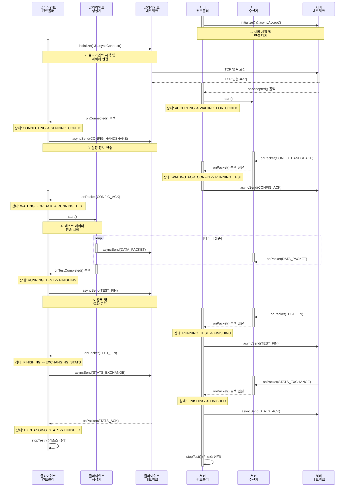

# 전체 동작 시퀀스 다이어그램

이 문서는 `MyIperf`의 클라이언트와 서버가 테스트를 시작하고 완료하기까지의 전체 상호작용 흐름을 상세하게 보여줍니다.

## 1. 다이어그램

## 2. 전체 시퀀스 설명

1.  **서버 준비**:
    *   서버 `TestController`가 `NetworkInterface`를 초기화하고 `asyncAccept`를 호출하여 클라이언트의 접속을 비동기적으로 기다립니다.

2.  **클라이언트 연결**:
    *   클라이언트 `TestController`가 `NetworkInterface`를 초기화하고 `asyncConnect`를 호출하여 서버에 연결을 시도합니다.
    *   TCP 3-way handshake를 통해 연결이 수립됩니다.

3.  **설정 교환 (Handshake)**:
    *   서버는 연결을 감지(`onAccepted`)하고, `PacketReceiver`를 시작하여 클라이언트로부터 올 데이터를 받을 준비를 합니다.
    *   클라이언트는 연결 성공(`onConnected`) 후, 테스트 설정을 담은 `CONFIG_HANDSHAKE` 메시지를 서버로 전송합니다.
    *   서버 `PacketReceiver`는 이 메시지를 받아 `TestController`에 전달하고, 서버 `TestController`는 이에 대한 응답으로 `CONFIG_ACK`을 클라이언트로 보냅니다.
    *   클라이언트는 `CONFIG_ACK`을 받으면 양쪽 모두 테스트를 진행할 준비가 된 것입니다 (`RUNNING_TEST` 상태).

4.  **테스트 데이터 전송**:
    *   클라이언트 `TestController`가 `PacketGenerator`를 시작합니다.
    *   `PacketGenerator`는 설정된 시간 동안 `DATA_PACKET`을 `NetworkInterface`를 통해 계속 전송합니다.
    *   서버 `PacketReceiver`는 들어오는 `DATA_PACKET`들을 지속적으로 수신합니다.

5.  **종료 및 결과 교환**:
    *   클라이언트에서 테스트 시간이 만료되면 `PacketGenerator`가 `TestController`에게 완료를 알립니다.
    *   클라이언트는 `TEST_FIN` 메시지를 보내 데이터 전송이 끝났음을 알립니다.
    *   서버는 `TEST_FIN`을 받고, 자신도 `TEST_FIN`으로 응답하여 양측 모두 데이터 전송이 끝났음을 확인합니다 (종료 핸드셰이크).
    *   클라이언트는 종료 핸드셰이크 완료 후, 자신의 통계 정보를 `STATS_EXCHANGE` 메시지로 서버에 보냅니다.
    *   서버는 통계를 수신한 후, 최종 확인 의미로 `STATS_ACK`를 클라이언트에 보냅니다.
    *   `STATS_ACK`를 받은 클라이언트를 포함하여 양측 모두 `FINISHED` 상태가 되며 테스트가 정상적으로 종료됩니다.

6.  **리소스 정리**:
    *   양측 `TestController`는 `stopTest()`를 통해 사용했던 모든 리소스(소켓 등)를 정리합니다.
