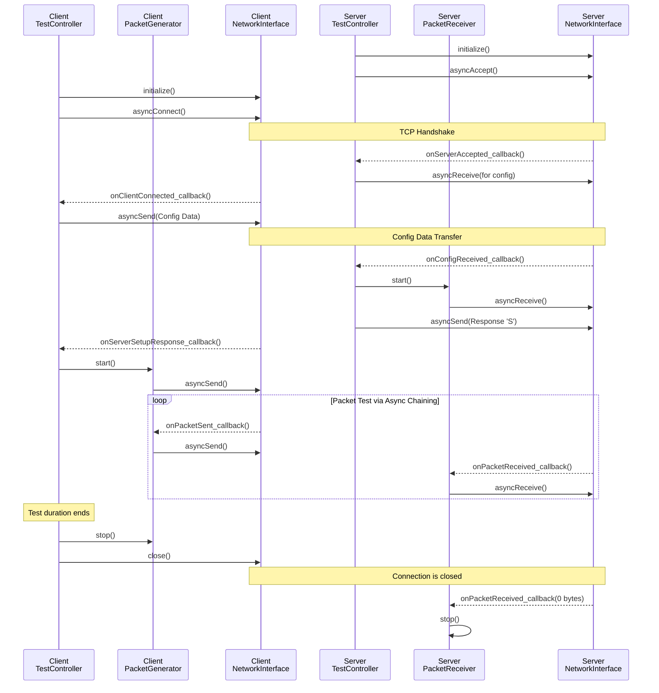

```mermaid
sequenceDiagram
    participant ClientTC as Client<br>TestController
    participant ClientPG as Client<br>PacketGenerator
    participant ClientNI as Client<br>NetworkInterface
    participant ServerTC as Server<br>TestController
    participant ServerPR as Server<br>PacketReceiver
    participant ServerNI as Server<br>NetworkInterface
    
    ServerTC->>ServerNI: initialize()
    ServerTC->>ServerNI: asyncAccept()
    
    ClientTC->>ClientNI: initialize()
    ClientTC->>ClientNI: asyncConnect()
    
    Note over ClientNI, ServerNI: TCP Handshake
    
    ServerNI-->>ServerTC: onServerAccepted_callback()
    ServerTC->>ServerNI: asyncReceive(for config)
    
    ClientNI-->>ClientTC: onClientConnected_callback()
    ClientTC->>ClientNI: asyncSend(Config Data)
    
    Note over ClientNI, ServerNI: Config Data Transfer
    
    ServerNI-->>ServerTC: onConfigReceived_callback()
    ServerTC->>ServerPR: start()
    ServerPR->>ServerNI: asyncReceive()
    ServerTC->>ServerNI: asyncSend(Response 'S')
    
    ClientNI-->>ClientTC: onServerSetupResponse_callback()
    ClientTC->>ClientPG: start()
    ClientPG->>ClientNI: asyncSend()
    
    loop Packet Test via Async Chaining
        ClientNI-->>ClientPG: onPacketSent_callback()
        ClientPG->>ClientNI: asyncSend()
        ServerNI-->>ServerPR: onPacketReceived_callback()
        ServerPR->>ServerNI: asyncReceive()
    end
    
    Note over ClientTC: Test duration ends
    ClientTC->>ClientPG: stop()
    ClientTC->>ClientNI: close()
    
    Note over ClientNI, ServerNI: Connection is closed
    
    ServerNI-->>ServerPR: onPacketReceived_callback(0 bytes)
    ServerPR->>ServerPR: stop()
```    