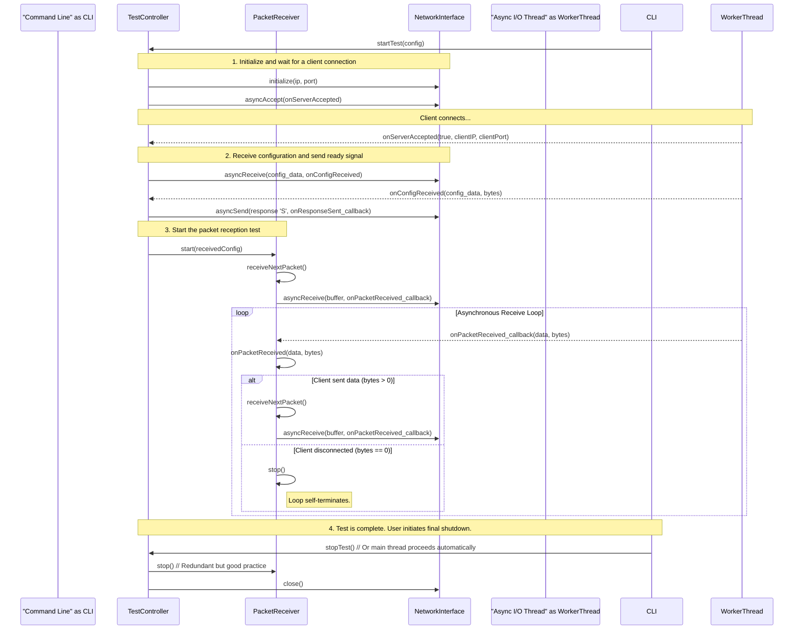

# Server Sequence Diagram (Async Chaining)

This diagram shows the flow of packet reception on the server side using the asynchronous chaining model.

```mermaid
sequenceDiagram
    participant "Command Line" as CLI
    participant TestController
    participant PacketReceiver
    participant NetworkInterface
    participant "Async I/O Thread" as WorkerThread

    CLI->>TestController: startTest(config)

    Note over TestController, NetworkInterface: 1. Initialize and wait for a client connection
    TestController->>NetworkInterface: initialize(ip, port)
    TestController->>NetworkInterface: asyncAccept(onServerAccepted)
    Note over TestController, WorkerThread: Client connects...
    WorkerThread-->>TestController: onServerAccepted(true, clientIP, clientPort)

    Note over TestController, NetworkInterface: 2. Receive configuration and send ready signal
    TestController->>NetworkInterface: asyncReceive(config_data, onConfigReceived)
    WorkerThread-->>TestController: onConfigReceived(config_data, bytes)
    TestController->>NetworkInterface: asyncSend(response 'S', onResponseSent_callback)

    Note over TestController, PacketReceiver: 3. Start the packet reception test
    TestController->>PacketReceiver: start(receivedConfig)
    PacketReceiver->>PacketReceiver: receiveNextPacket()
    PacketReceiver->>NetworkInterface: asyncReceive(buffer, onPacketReceived_callback)

    loop Asynchronous Receive Loop
        WorkerThread-->>PacketReceiver: onPacketReceived_callback(data, bytes)
        PacketReceiver->>PacketReceiver: onPacketReceived(data, bytes)
        
        alt Client sent data (bytes > 0)
            PacketReceiver->>PacketReceiver: receiveNextPacket()
            PacketReceiver->>NetworkInterface: asyncReceive(buffer, onPacketReceived_callback)
        else Client disconnected (bytes == 0)
            PacketReceiver->>PacketReceiver: stop()
            Note right of PacketReceiver: Loop self-terminates.
        end
    end

    Note over CLI, TestController: 4. Test is complete. User initiates final shutdown.
    CLI->>TestController: stopTest() // Or main thread proceeds automatically
    TestController->>PacketReceiver: stop() // Redundant but good practice
    TestController->>NetworkInterface: close()
```