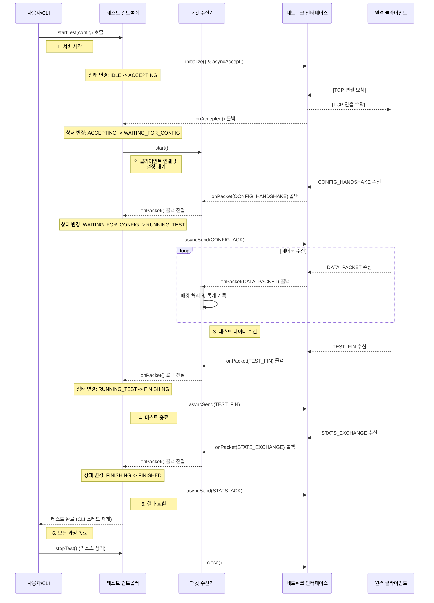

# 서버 동작 시퀀스 다이어그램

이 문서는 `MyIperf` 서버가 실행된 후 클라이언트의 접속을 받아 테스트를 완료하기까지의 내부 컴포넌트 간 상호작용과 메시지 흐름을 순서대로 보여줍니다.

## 1. 다이어그램

## 2. 시퀀스 설명

1.  **서버 시작**:
    *   사용자가 서버 모드로 프로그램을 실행하면, `CLIHandler`가 `TestController`의 `startTest()`를 호출합니다.
    *   `TestController`는 `NetworkInterface`를 초기화하고 `asyncAccept()`를 호출하여 클라이언트의 접속을 비동기적으로 기다립니다 (`ACCEPTING` 상태).

2.  **클라이언트 연결 및 설정 수신**:
    *   클라이언트가 접속하면 `onAccepted` 콜백이 호출되고, `TestController`는 `PacketReceiver`를 시작하여 데이터를 받을 준비를 합니다 (`WAITING_FOR_CONFIG` 상태).
    *   클라이언트로부터 `CONFIG_HANDSHAKE` 메시지를 수신하면, `PacketReceiver`는 이를 `TestController`에 전달합니다.

3.  **테스트 진행**:
    *   `TestController`는 수신한 설정을 바탕으로 `CONFIG_ACK` 메시지를 클라이언트에게 전송하고, `RUNNING_TEST` 상태로 전환합니다.
    *   이후 클라이언트가 보내는 `DATA_PACKET`들을 `PacketReceiver`가 지속적으로 수신하고, 내부적으로 패킷을 처리하며 통계를 기록합니다.

4.  **테스트 종료**:
    *   서버는 클라이언트로부터 `TEST_FIN` 메시지를 받으면 테스트 데이터 수신이 완료되었음을 인지합니다.
    *   `TestController`는 `FINISHING` 상태로 전환하고, 종료 핸드셰이크를 위해 자신도 `TEST_FIN` 메시지를 클라이언트로 전송합니다.

5.  **결과 교환**:
    *   서버는 클라이언트로부터 `STATS_EXCHANGE` 메시지(클라이언트 측 통계)를 수신합니다.
    *   `TestController`는 수신된 통계를 기록하고, 최종 확인을 위해 `STATS_ACK` 메시지를 클라이언트로 전송한 뒤 `FINISHED` 상태로 전환됩니다.

6.  **최종 종료**:
    *   `TestController`는 대기 중이던 메인 CLI 스레드를 재개시키고, `stopTest()`가 호출되어 모든 네트워크 리소스를 정리하고 프로그램을 종료합니다.
