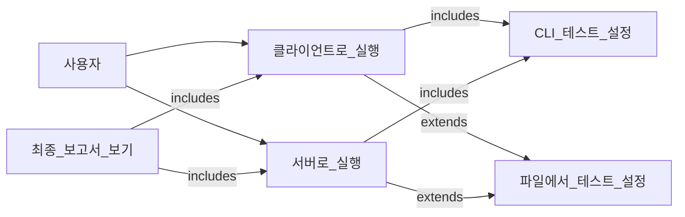

# MyIperf 유스케이스 다이어그램

이 문서는 사용자 관점에서 `MyIperf` 애플리케이션의 주요 사용법을 설명하고, 액터, 그들의 목표, 그리고 시스템과 상호작용하는 방식을 식별합니다.

## 1. 유스케이스 다이어그램 (Mermaid)

## 2. 액터

*   **사용자**: `MyIperf` 애플리케이션과 상호작용하는 주요 액터입니다. 일반적으로 두 머신 간의 네트워크 성능을 측정해야 하는 네트워크 관리자, 개발자 또는 시스템 엔지니어입니다. 사용자는 명령줄 인터페이스를 통해 시스템과 상호작용합니다.

## 3. 유스케이스

이 섹션은 사용자가 MyIperf 시스템과 상호작용하는 주요 방법을 설명합니다.

*   **(서버로 실행)**
    *   **목표**: 클라이언트로부터의 연결을 수신하고 수락하기 위해 애플리케이션을 서버 모드로 시작합니다.
    *   **요약**: 사용자는 `--mode server` 인수로 애플리케이션을 시작합니다. 그러면 서버는 클라이언트가 연결하기를 기다립니다. 클라이언트 테스트가 완료되면 2단계 테스트 및 통계 교환에 참여한 다음 최종 보고서를 출력합니다.
    *   **포함 관계**: `CLI로 테스트 설정`
    *   **확장 관계**: `파일에서 테스트 설정`

*   **(클라이언트로 실행)**
    *   **목표**: 서버에 대한 성능 테스트를 시작하기 위해 애플리케이션을 클라이언트 모드로 시작합니다.
    *   **요약**: 사용자는 `--mode client`로 애플리케이션을 시작하고 서버의 IP 주소를 지정합니다. 클라이언트는 서버에 연결하고 구성을 보낸 다음 2단계 성능 테스트를 실행합니다.
    *   **포함 관계**: `CLI로 테스트 설정`
    *   **확장 관계**: `파일에서 테스트 설정`

*   **(CLI로 테스트 설정)**
    *   **목표**: 명령줄 인수를 사용하여 테스트 매개변수를 지정합니다.
    *   **요약**: 이것은 기본 구성 방법입니다. 사용자는 테스트 시간 (`-t`), 포트 번호 (`-p`), 데이터 전송 속도와 같은 매개변수를 지정할 수 있습니다. 기본 구성이 항상 필요하므로 클라이언트 및 서버로 실행하는 경우 모두에 포함되는 유스케이스입니다.

*   **(파일에서 테스트 설정)**
    *   **목표**: 외부 JSON 파일에서 테스트 매개변수를 로드합니다.
    *   **요약**: 이것은 선택적 흐름입니다. 사용자는 `-c` 인수를 사용하여 `.json` 구성 파일의 경로를 제공할 수 있습니다. 이러한 설정은 함께 제공된 다른 명령줄 인수로 재정의될 수 있습니다. 이 유스케이스는 모든 인수를 명령줄에 제공하는 대안이므로 표준 클라이언트/서버 실행 유스케이스를 "확장"합니다.

*   **(최종 보고서 보기)**
    *   **목표**: 성능 테스트 결과를 확인합니다.
    *   **요약**: 성공적인 테스트가 끝나면 시스템은 상세한 2단계 요약 보고서를 콘솔 및/또는 로그 파일에 자동으로 기록합니다. 이 보고서에는 클라이언트-서버 및 서버-클라이언트 테스트 모두에 대한 처리량, 총 전송 바이트, 오류 수가 포함됩니다. 이것은 완전한 테스트 실행에 포함된 부분입니다.